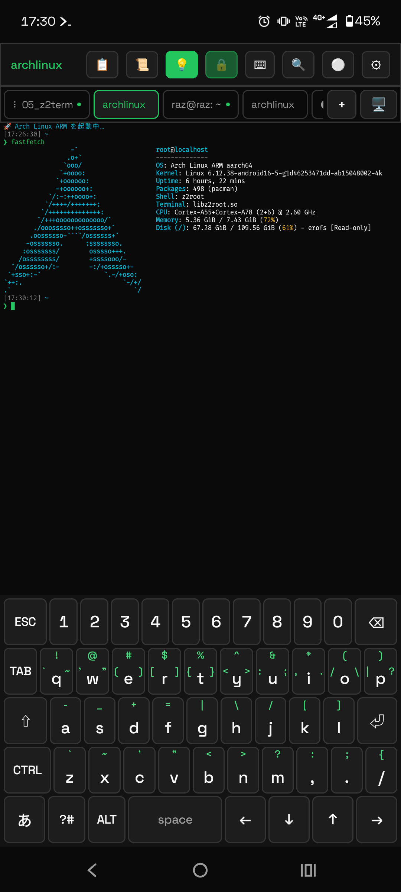
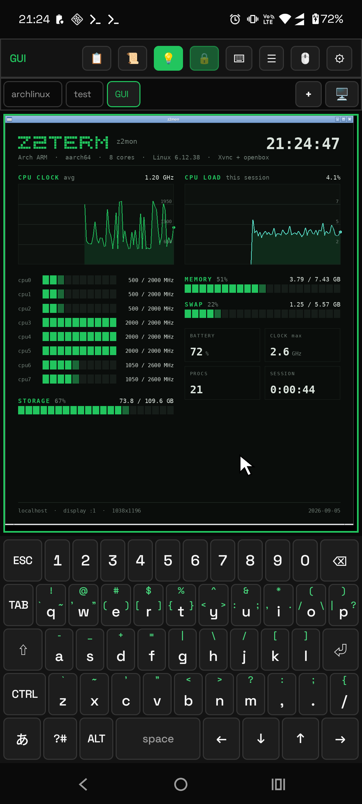

# Z2Term — Zero 2 Terminal

[English](README.md) ・ **日本語**

[](https://github.com/orgsonai/z2term/releases/latest)
[](LICENSE)


### Android のターミナルであり、Android を操作する手段でもあるアプリ。

**Z2Term** (ズィートゥーターム) は Alpine / Ubuntu / Arch / Kali を **root 不要**で動かし、
タブの中に **Linux のデスクトップ**を開き、シェルから端末そのものに手を伸ばせます —
通知を読む、通知シェードの返信欄であなたに質問する、充電・ネットワーク・受信 SMS の変化で
スクリプトを走らせる、といったことができます。

- **root も PC もセットアップスクリプトも不要。** APK を 1 つ入れれば `apk` / `apt` / `pacman` が使えるディストロがそのまま動きます。既定の実行エンジン (`z2root`) は本アプリ用に書いた ptrace ベースのユーザ空間実装です。
- **シェルから Android に話しかけられる。** 約 40 個の `z2-*` コマンド（通知・クリップボード・センサー・ライト・Intent・アラーム・自端末への無線 `adb`）に加え、端末のイベントでスクリプトを起動する自動化ハブ `z2-when` を内蔵。**アプリを開かなくても、再起動をまたいで動き続けます。**
- **バーに自由な枠を追加する。** 「＋」からマクロ・コマンドを登録し、z2-icon のアイコンを選べます。メニュー上のスワイプでタブを切り替えられます。
- **取っ手にジェスチャーを割り当てる。** 6種類のジェスチャーに、アプリ起動・待機・コマンド・単発スワイプなどをGUIで順番に割り当てられます。オートスクロールは速度変更・反転・対象位置指定に対応し、タップで停止します。[設定方法](docs/ja/HANDBOOK.md#96-画面に浮かべるエッジパネル)。
- **日本語で使える。** かな漢字変換・予測・学習を備えた IME を内蔵し、**OS の入力メソッドとして有効化**して他アプリでも使えます。

> Zero to Ship プロジェクトの第5作目です。

## スクリーンショット

<table>
  <tr>
    <td align="center" width="50%"><br><sub>CUI — Arch Linux ARM 端末 + 独自キーボード</sub></td>
    <td align="center" width="50%"><br><sub>GUI — Xvnc 上のデスクトップアプリ</sub></td>
  </tr>
</table>

## なぜもう一つターミナルアプリを作るのか

Android のターミナルには既に成熟した選択肢があり、**最大のパッケージ資産と実績**が欲しいなら
Termux が正解です。Z2Term は別の問いから作られています —
**ターミナルが「端末を操作する正面の手段」になり、しかも APK 1 つで完結したらどうなるか。**

| | Z2Term | Termux + アドオン群 |
|---|---|---|
| Linux ディストロ | z2root で Alpine / Ubuntu / Arch / Kali を導入可 | `proot-distro` パッケージで導入 |
| Linux GUI | **アプリ内に GUI タブ**（Xvnc + 内蔵 RFB クライアント）。音声・動画つき。同じビューアで**リモートの VNC / RDP** も開ける | 別途 X11 / VNC / RDP ビューアアプリ |
| シェルから Android を操作 | **内蔵**（約 40 個の `z2-*`） | 別アプリ（コンパニオン）が必要 |
| イベント駆動の自動化 | **内蔵**（`z2-when`: 充電・電池残量・時刻/cron・Wi-Fi・回線・起動・共有・SMS・センサー・通知・ファイル追加）。自動化タブ・実行ログ・一括停止つき | 別アプリ + 多くは市販の自動化アプリと併用 |
| 日本語入力 | **IME 内蔵**（変換・予測・学習）。OS の入力メソッドとしても選べる | OS のキーボード |
| SSH / SFTP・FTP・WebDAV・SMB クライアントと `sshd` | 内蔵。各サービスは既定で SSH ポートフォワードし、SSH 鍵は Android Keystore が保持 | 自分でパッケージを入れる |
| 配布 | GitHub Releases（本リポジトリ） | F-Droid と独自リポジトリ |

どちらも GPL-3.0 で、どちらもテレメトリを取りません。既に満足している Termux 環境がある人にとって、
Z2Term の存在理由は上の表の**2・3・4 行目**です。

キーボードの表示・非表示はツールバーの **⌨ ダブルタップ**で切り替えます。**設定 → キー配列（自分で作る）**には補助キーバーのトグルと編集があり、端末・GUI で同じ割り当てを使えます。GUI メニューの日本語表示には Android の既存フォントも利用します。更新後は GUI を開き直してください。

## ダウンロード

**最新の APK は GitHub Releases から直接ダウンロードできます**（ビルド不要）:

- 最新版に飛ぶ: **<https://github.com/orgsonai/z2term/releases/latest>**

各リリースに付く APK は `z2term-<版数>.apk` の 1 つだけです。サイズはリリースページで確認できます。

OS も第三者 prebuilt も同梱していないので、初回は ⚙設定 › Linux環境 から使いたい OS を選んで
取得します（0.8.314。公式配布元から取得して SHA-256 で検証。更新のたびに取り直すことはありません）。
更新時にもOS本体を再取得する必要はありません。

⚠ **0.8.358 までは Alpine を同梱した約 190MB の APK（`full`）も配っていましたが、0.8.359 で
やめました。** 初回のダウンロードが省ける以外の違いが無いのに、どちらを落とすか迷わせるだけだった
ためです。`full` を使っている場合は、この APK がそのまま上書き更新になります（package ID は同じ）。

Android 端末で APK をタップ → 「提供元不明のアプリ」のインストールを許可するとインストールできます。
（Google Play では配布していません）

### アップデートの方法

合うものを選んでください。

- **アプリ内で更新（0.8.371）** — *設定 → アプリ情報 → 更新を確認* →**「ダウンロードしてインストール」**。
  **ボタンを押したときだけ** GitHub の最新版に問い合わせ（自動チェックは一切せず、押すまでネットワークにも
  触れません）、新版の APK を落として**入れ替えの確認画面まで**出します。⚠ Android の決まりで**最後の 1 タップは
  必ずご自身**です（アプリが黙って自分を入れ替えることはできません）。初回だけ「不明なアプリのインストール」の
  許可が要ります。端末からは **`z2-update`**（`--check` / `--keep` / `--dir` あり）。落とした APK は既定で
  入れ替え後に消えます。⚠ F-Droid など配布元から入れた版では断ります（更新はそちらから）。
- **手動** — Releases から新しい APK を落としてタップ（上書きインストールされ、データは残ります）。
- **自動** — [Obtainium](https://github.com/ImranR98/Obtainium) に
  `https://github.com/orgsonai/z2term` を登録します。Releases を監視し、新版が出ると**ワンタップで更新**（ストア不要）。

## 現在のバージョン

**1.0.1（versionCode 699）**: 分割表示の各枠の見出しの右端に、拡大ボタンを足しました。押すと、その枠のタブだけの 1 画面に戻ります（見出しのダブルタップと同じ動きです。GUI ボタンを長押しして「1画面へ戻す」を選ぶ手間が要りません）。あわせて、⚙設定 ›「案内を表示」の一覧から `watch-basic`・`battery-alert`・`daily-report` を外しました（マクロ自体は今までどおり `z2-macro install <名前>` で入れられます）。

**1.0.0（versionCode 698）・安定版**: 最初の安定版です。0.9.34 からの変更は 1 つで、実行ビットの無いファイル（権限 644 など）を直接実行しようとすると、Linux と同じく「Permission denied」になります（これまでは起動していました。`chmod +x` すれば実行できます）。共有ストレージ（`/sdcard`）のように実行ビットを付けられない場所のファイルは、これまでどおり直接実行できます。

**0.9.34（versionCode 697）・安定版の候補**: root から別のユーザーへ切り替えた先でも `su`・`sudo` で root へ戻れるようにしました（0.9.33 で、切り替えた先が本当にそのユーザーとして見えるようになった結果、戻れなくなっていました）。すでに入れてある OS では、`su`・`sudo` を入れ直すと有効になります（例: Arch は `pacman -S sudo util-linux`）。root のまま使う分には、入れ直さなくてもこれまでどおり動きます。

**0.9.33（versionCode 696）・安定版の候補**: OpenSSH の `sshd` に接続できるようにしました（これまでは接続のたびに切れていました）。あわせて、root から別のユーザーへ切り替えたとき（`su`・`runuser` など）、切り替えた先のユーザーとして見えるようになりました（これまでは何をしても root のままに見えていました）。

**0.9.32（versionCode 695）・安定版の候補**: 0.9.31 の修正では直っていなかった、操作自動化の「タップ → 次の画面を `wait-ui` で待つ」が止まる問題を直しました（止めていたのは実行中の見張りのほうでした）。

**0.9.31（versionCode 694）・安定版の候補**: 操作自動化で、要素をタップして同じアプリの次の画面を `wait-ui` で待つと、毎回「Target application changed」で止まる問題を直しました。

**0.9.30（versionCode 693）・安定版の候補**: キーボードの顔文字・AA パッドに、自分で足したものが並ぶ「✎」タブを足しました。⚙設定 › キーボード・入力 ›「顔文字・AA の追加」から足せます（複数行も可）。バックアップにも入ります。あわせて、最初から入っている複数行の AA を 16 個から 40 個に増やしました。

**0.9.29（versionCode 692）・安定版の候補**: 設定の「使い方（Tips）」に、タブの「+」長押しで別の OS を 1 枚だけ開けることを足しました。

**0.9.28（versionCode 691）・安定版の候補**: タブの「+」を長押しすると、OS を選んでそのタブだけその OS で開けるようになりました。設定で選んでいる OS は変わりません。

**0.9.27（versionCode 690）・安定版の候補**: `/system/bin/pm` と `am` が、Alpine・Ubuntu・Kali では「cmd: inaccessible or not found」で終わる問題を直しました。

**0.9.26（versionCode 689）・安定版の候補**: 0.9.25 を実機で確かめて残っていた 2 件を直しました。Android 側のコマンド（`/system/bin/cmd`・`pm`・`am`）がタブからそのまま呼ぶと「Failed transaction」で終わる問題と、一部のリアルタイムシグナル（36 / 38）が無視のまま始まる問題です。

**0.9.25（versionCode 688）・安定版の候補**: 各 OS に追加のコマンドを入れて確かめ、見つかった不具合を直しました。4095 バイトを超える長い引数が途中で切れる問題、先頭行（`#!`）の無いスクリプトが「Permission denied」で実行できない問題、root なのに読み取り専用のファイルへ書けない・読み取り専用のフォルダを消せない問題（Ubuntu でパッケージの導入が途中で止まる原因でした）、フォルダを名前で辿ると差し込まれたフォルダ（`/proc` やホームの一部）の中身を取り違える問題、`chroot` が使えない問題（OpenSSH の `sshd` に接続できない原因の 1 つでした。接続はまだできません）です。

**0.9.24（versionCode 687）・安定版の候補**: どの OS でも動かなかったコマンドを直しました。`uptime` と `w` が「Cannot get system uptime」で終わる問題（Arch / Ubuntu）、Android 側のコマンドを `/system/bin/ls` のように呼ぶと「Unknown command」になる問題、`/system/bin/pm` や `am` が「expected absolute path」で起動しない問題です。`/proc/uptime`・`/proc/loadavg`・`/proc/version` も読めるようになりました。

**0.9.23（versionCode 686）・安定版の候補**: 設定の「Linux 環境」で OS を選ぶと、新しいタブで開くようにしました。これまでは使っているタブを閉じて作り直していたので、動かしていた処理や画面の履歴が消えていました。元のタブはそのまま残ります。

**0.9.22（versionCode 685）・安定版の候補**: どの OS でも止まりやすかったところを直しました。Ctrl+Z で止めたものが `fg` で戻らずタブが固まる問題、`su`／`sudo` が「System error」で使えない問題（Ubuntu・Arch）、パイプの書き手が終わらない・`trap` が呼ばれないことがある問題を解消しています。`~/.local/bin` に入れたコマンドは、何も設定しなくても名前で打てます。Alpine でも、JS を 1 つの実行ファイルに埋め込んだ種類の CLI が起動するようになりました。「接続先」の接続は、今のタブを置き換えず新しいタブで開きます。 ユーザーの追加（`useradd`／`passwd` など）と、ハードリンクを含むパッケージの導入（Alpine の `tzdata` など）も通るようになりました。 SSH で入ったときも、接続を待ち受けるプログラム（`tmux`、`gpg` の暗号化など）が動きます。

**0.9.17（versionCode 680）・安定版の候補**: 変換で出せる記号を増やしました。「きごう」で辞書の記号が途中で切れずに全部並び、①②・♡・✓・αβ・㎝ など辞書になかった記号も加わります。「まる」→ ①②…、「はーと」→ ♡、「ちぇっく」→ ✓、「ぎりしゃ」→ αβγ…、「たんい」→ ㎝㎏… のように読みからも引けます。読みと完全に一致する辞書の語は、候補が多くても最後まで全部並びます。

**0.9.16（versionCode 679）・安定版の候補**: 補助キーバーの配列編集画面のサンプル表示が、実際のバーと同じキー幅で横にスクロールするようになりました。キーが多くても全部が1画面に押し込まれて細くなることがなくなります。

**0.9.15（versionCode 678）・安定版の候補**: エッジパネルでスクロールを始めたときの速度表示（トースト）を短くし、続けて操作したときは前の表示を消して新しい速度に置き換えるようにしました。表示が積み重なって画面が重くなることがなくなります。

**0.9.14（versionCode 677）・安定版の候補**: 補助キーバーの既定の並びの後ろに F1〜F12 を追加しました。バーを横にスクロールすると押せます。配列を編集して保存している場合は、編集画面の「デフォルトに戻す」で追加されます。

**0.9.13（versionCode 676）・安定版の候補**: エッジパネルの連続スクロールが、範囲の端で指を置き直すたびにかくつき、一定以上の速度で速くならなかった問題を修正しました。指が端に着くと、離す前に2本目の指を始めに置いて持ち替えるので、画面からは指が一度も離れず、止まらずに流れ続けます。範囲の長さによる速度の上限もなくなりました。

**0.9.12（versionCode 675）・安定版の候補**: エッジパネルの連続スクロールで、速度を一定以上に上げても速くならなかった問題を修正しました。指が範囲の端に届いて移動量が短くなった回も、1回分の時間（80ms）をそのまま使っていたため、1回で範囲の端まで届く速度を超えると、それ以上は速くなりませんでした。短くなった回は、設定速度で動いたときの時間で送ります。

**0.9.11（versionCode 674）・安定版の候補**: OS の入力方法として使うキーボードで、端末によっては三ボタン（戻る・ホーム・履歴）とキーボードの間に隙間ができていた問題を修正しました。三ボタンの高さぶんキーボードを持ち上げる処理が、窓がすでに三ボタンを避けて置かれる端末（Android 14 以前など）でも働き、二重に持ち上がっていました。キーボードが三ボタンと実際に重なっている高さだけを測って持ち上げるので、どの端末でも隙間なく三ボタンのすぐ上に出ます。

**0.9.10（versionCode 673）・安定版の候補**: エッジパネルの連続スクロールのかくつきを修正しました。これまでは前のスワイプが終わったと通知を受けてから続きを送っていたため、つなぎ目ごとに指が一瞬止まっていました。続きを3回分先に送っておき、Android が前の動きの直後へ隙間なくつなぐようにしました。各回の移動量は一定で、遅れを取り戻すための加速は行いません。範囲の端では指を動かしたまま離し、画面が慣性で動いている間に次の指を置きます。

**0.9.9（versionCode 672）・安定版の候補**: エッジパネルの連続スクロールで、ブラウザを下スワイプ（上へ戻る方向）で動かせなかった問題を修正しました。上へ戻るとブラウザの上部バーが再表示され、そこから指を動かしていたためです。指を動かす範囲を、上下の端から15%以上離した画面の60%にしました。かくつきを抑えるため、指を離さずに送る1回分を160msへ延ばし、指を置き直した後の遅れは一度に取り戻さず、1回あたり通常量の1.5倍までに分けて戻します。

**0.9.8（versionCode 671）・安定版の候補**: 自動の連続スクロールは、端末本文への直接操作を保ち、その他の画面では指を離さず継続する縦スワイプを使います。ページ単位の操作による停止と再開を避け、操作開始の判定距離・処理待ち・指の位置を戻す時間を速度計算に含めます。停止や折り返しでは指の速度を落としてから離し、不要な慣性を抑えます。

**0.9.7（versionCode 670）・安定版の候補**: エッジパネルのスクロール対象から自アプリを除外していた問題を修正し、端末本文にも画面へ触らずスクロールする操作を追加しました。縦方向の操作を使い、横ページ切替を対象から外します。細かな送り量への対応を確かめて速度を計算し、画面単位でしか動かない部品では実際の移動量に合わせて間隔を調整します。スワイプ方式も短い操作の反復を減らします。 手動・定期バックアップにエッジパネル設定・項目・メモと履歴を追加しました。

**0.9.6（versionCode 669）・安定版の候補**: root の chroot 使用後に共有ホームの権限でバックアップを戻せない問題を修正しました。合言葉あり・なしのどちらも、保存先へのアクセスを整えてから取り込みます。失敗時は保存先のアクセス権も案内します。

**0.9.5（versionCode 668）・安定版の候補**: エッジパネルの文字入力欄からもスワイプで前後のタブへ移動できるようにしました。入力開始はタップを確定したときだけで、スワイプでは入力欄にフォーカスを移しません。入力中もタブ切り替え方向のスワイプを優先し、長押しによる選択と項目の並び方向のスクロールは維持します。

**0.9.4（versionCode 667）・安定版の候補**: 前回の常駐サーバーのプロセス番号を別の Android アプリが使っていると、常駐サーバーが起動できない問題を修正しました。そうしたプロセスは「存在しない」と扱い、起動し直せるようにします。スニペットタブは、最後に選んだグループで開くようになりました。更新後は新しい端末タブを開いてください。

**0.9.3（versionCode 666）・安定版の候補**: Linux のルートディレクトリが書き込み禁止の環境で、常駐サーバーの開始日時照合が引き続き失敗する問題を修正しました。補完データを `/tmp` に保存し、読み取り用に開いた後で削除します。通信用ソケットを指す絶対パスのシンボリックリンク経由で接続できない問題も修正しました。更新後は新しい端末タブを開いてください。

**0.9.2（versionCode 665）・安定版の候補**: バックグラウンドサーバーの起動互換性を改善しました。Android が端末の起動日時の読み取りを制限する環境で、プロセスの開始日時を調べる処理が失敗する問題と、通信用ソケットの保存先が長くなると起動できない問題に対応します。更新後は新しい端末タブを開いてください。

**0.9.1（versionCode 664）・安定版の候補・ビルド未検証**: 分割表示で、見出しを長押ししてもう一方へドラッグすると上下／左右が入れ替わり、見出しをダブルタップするとそのタブだけの 1 画面に戻ります。⌨ トリプルタップのサイズ調整帯は端末（GUI）の上に重ねて出し、開いても端末の大きさが変わらないようにしました。下に置いたアプリ内キーボードの幅を 100% 未満にすると、キーボードが端末の上に浮き、上端のつまみをドラッグして自由に動かせます（位置は縦横別に記憶・端末タブのみ）。0.9.0 は公開せず、この版を安定版の候補として出します。

**0.9.0（versionCode 663）・安定版の候補・ビルド未検証**: 0.8 系の alpha を終え、安定版 1.0 の候補として出す版です。機能は 0.8.654 から変えていません。以後 1.0 までは不具合の修正だけを 0.9.x として出します。F-Droid へはこの版から提出します。

**0.8.654-alpha（versionCode 662）・ビルド未検証**: ⚙設定に「エッジパネル」を追加し、「エッジパネルの設定を開く」からパネルの設定画面へ直接入れるようにしました。エッジパネルがオフでも開けます。そのときは端のバーを出さず、閉じたあともオフのままです。パネルがまだ無いときは作り方の案内（edge-panel）を、「他のアプリの上に重ねて表示」が未許可のときは許可の画面を開きます。

**0.8.653-alpha（versionCode 661）**: GUI の長押しメニューの日本語表示に Android の既存フォントを使えるようにしました。キーボード表示バーを廃止し、表示・非表示はツールバーの ⌨ ダブルタップに統一。補助キーバーの ON/OFF と編集は「キー配列（自分で作る）」へ移し、端末・GUI 共通で配置・幅・分割・ジェスチャを割り当てられます。既存の ON/OFF 設定は保持します。更新後は GUI を閉じて開き直してください。 デスクトップのリリースビルド・関連単体テスト168件・lint（エラー／警告0件）を確認。GUIの実機表示とタッチ操作は未確認です。

**0.8.652-alpha（versionCode 660）・ビルド未検証**: RSS ビューの「購読先」から URL の追加・変更・削除に対応。GUI のピンチ縮小がホイール入力になり仮想デスクトップを切り替えてしまう動作を修正し、背景の長押しメニューに切り替え操作を追加しました。

**0.8.651-alpha（versionCode 659）**: SSH の接続先に「家の中での宛先（任意）」を追加しました。家の Wi-Fi から自宅の外向きアドレスへ繋ぐと、ルーターによっては VNC・RDP・シェルが `ConnectException` で繋がりませんでした。家の中の宛先を入れておくと、同じネットワークにいて応答したときだけ、そちらへ踏み台を通さず直接繋ぎます。家の外では今までどおり外向きの宛先を使います。

**0.8.650-alpha（versionCode 658）**: 不具合と警告の整理です。`z2doctor` が、常駐サーバーで動いている sshd を「not running」と表示していた問題を直しました。エッジパネルのスクロール量の指定は、使える Android 15 以降でだけ渡すようにしました（Android 14 では無視されていました）。共有サーバーの見回りは、アプリが休止から戻ったときにまとめて何度も走らないようにしました。英語表示の「1 files」のような数と名詞の不一致をなくし、スペイン語の複数形を補いました。使われていない文言を削除し、lint の警告を 251 件から 0 件にしました。

**0.8.649-alpha（versionCode 657）**: エッジパネルの「配置」の見本が、大きさ自動のときに実際のパネルと一致しなかった問題を直しました。ターミナルを置いたパネルなどで、メモやターミナルの段が見本でも残りの高さいっぱいに描かれ、ドラッグし始めの％も実物どおりになります。アイコンの段の高さも実物に合わせ、下に空きがあるパネルは見本にも空きを描きます。

**0.8.648-alpha（versionCode 656）**: エッジパネルの「配置」で、見本の下に「すべての大きさを自動に戻す」を追加しました。そのタブのすべての段の高さと横幅を一度に自動へ戻します。段の並びは変わりません。

**0.8.647-alpha（versionCode 655）**: エッジパネルで段の高さや項目の横幅を変えると、アイコンがそれに合わせて自動で拡大・縮小するようにしました。高さを付けた段では段いっぱいの大きさに、幅が狭い項目では収まる大きさになり、はみ出さなくなりました。

**0.8.646-alpha（versionCode 654）**: エッジパネルの「配置」を使いやすくしました。見本が実際のパネルと同じ縦横比になり、項目を長押しでつかんで別の段や段と段の間（新しい段）へ移せます。見本の段の下の線を上下に、項目の間の線を左右にドラッグすると、段の高さと項目の横幅を変えられます（「大きさを戻す」で自動に戻ります）。一覧の↑↓は、段の中の順番を変える←→と、置く段を1回で選ぶ「段 N ▾」に替え、操作しても一覧が先頭へ戻らなくなりました。

**0.8.645-alpha（versionCode 653）**: エッジパネルの並べ方を「段」に作り直しました。同じ段の項目は横に並び、段は上から積み重なるので、アプリのアイコンを横に並べてその下にメモを置くといった組み合わせができます。並べ方はタブごとになり、ほかのタブへ影響しません。ターミナル・メモ・ビューのある段は、パネルの高さが決まっているとき残りの高さいっぱいに広がります。設定画面は「配置／パネル／操作／管理」に分け、「配置」では段ごとの一覧と見本を見ながら↑↓で並べ替えます。既存のパネルは見た目を変えずに使え、最初に並べ替えたときに段組みへ切り替わります。CLI では `z2-edge set ID:項目 row=N` で段を指定できます。

**0.8.644-alpha（versionCode 652）**: エッジパネル（設定画面を含む）の入力欄や選択できる文字で範囲選択したとき、切り取り・コピー・貼り付け・すべて選択のツールバーが出るようにしました。エッジパネルは他のアプリの上に重ねる窓で、Android 標準のツールバーが表示されないため、選択範囲の上（入りきらなければ下）にアプリ側で表示します。

**0.8.643-alpha（versionCode 651）**: 分割中はGUI専用の外枠と余白を表示せず、GUI／CUI間の入力先切り替えで表示領域が伸縮しないようにしました。キーボードの開閉状態と領域確保も引き継ぎます。独立した「配置」ボタンを廃止し、タブバーを従来の寸法に戻しました。＋の隣のGUI（🖥）ボタンを長押しすると配置を開き、短く押すと従来どおりGUIを開きます。設定のTipsにも操作案内を追加しました。 デスクトップのリリースビルド、関連単体テスト73件、lint（エラー0件）で確認しました。 実機でも関連テスト14件が成功し、縦横画面・上下左右分割・内蔵／システムキーボードの12条件で入力先切り替え中の各フレームの寸法を確認しました。キーボードの開閉状態の引き継ぎとGUIボタンのタッチ長押しも確認済みです。

**0.8.642-alpha（versionCode 650）**: 「配置」から端末・GUI・VNC・RDPを上下／左右に並べ、外部画面へ表示できます。設定にローカルGUIの直接表示（XWD読取り、入力は既存RFB、試験機能）を追加。`z2-file pick/save` でAndroidの文書選択・書き出し、スニペットの登録で他アプリの選択文章を加工・確認して戻せます。用途別の処理はユーザーのコマンド／マクロに置きます。直接表示は起動時の解像度に固定、GPU高速化は含みません。通常版の上書き・起動と文章加工画面の表示を実機確認し、別パッケージで文書取り込み等のテスト6件が成功しました。外部画面・分割操作・文章置き換え・Androidでの直接描画は未検証です。 [Workspace](docs/ja/WORKSPACE.md).

**0.8.641-alpha（versionCode 649）**: エッジパネルの項目編集に、全種類の部品・動作の使い方と入力例を追加しました。「部品の選び方」で用途を確認でき、選択した動作の説明と次に必要な設定がその場に出ます。空欄には「この例を入力」で例を入れられます（入力のみで、保存・実行はしません）。更新間隔・実行時間・選択肢・大きさにも説明を添え、「文字表示」はHTMLも含む「表示」に改名しました。6言語対応。タブ欄のスワイプは欄内だけを横スクロールし、ビュー本文の横スワイプは隣のタブへ切り替えます。ビューの更新方式は「手動のみ」（既定）／「自動」から選択できます。「更新」「拡大」ボタンも個別に表示をON/OFFできます。用途固有の処理は引き続きマクロ側です。デスクトップでリリースビルド・関連テスト133件・lintDebug（エラー0件）、Android実機でタッチ配送・表示設定・汎用フォームのテスト7件が成功しました。実際のパネルを指で操作する確認は未実施です。

**0.8.640-alpha（versionCode 648）**: エッジパネルに汎用のビュー（`type=view`）を追加しました。`z2-view --edge パネル:項目` でHTMLを送れます。別ファイルの操作定義（`--controls`）で、自由入力・日時・選択欄のフォームと操作ボタンを作り、入力値を導入済みマクロの引数へ渡せます。アプリは用途を解釈せず、RSSの記事取得やリマインダーの保存・予約・追加・削除はマクロ側です。同梱マクロはこの公開仕様を使う例として更新しました。新しい依存はありません。[ビューとフォームの仕様・使い方](docs/ja/VIEWER.md)。デスクトップでリリースビルド・関連テスト104件・lintDebug成功。実機未確認。

**0.8.639-alpha（versionCode 647）・ビルド成功／実機で確認済み**: root 端末の裏機能「実行エンジン chroot」で、パッケージを入れようとすると空き容量が十分あるのに `not enough free disk space` で必ず失敗していたのを直しました。chroot した側から `/proc/self/mounts` を読むと、Android のルートは chroot の外なので現れず、rootfs 自体はマウントではないため **`/` の行が 1 つも無い**状態でした。`/etc/mtab` はそこへの symlink なので、「いまいるファイルシステム」を知りたいツールが軒並み誤ります（pacman は cachedir のマウント先を決められず中止していました）。**rootfs を自分自身に bind mount** して `/` として見えるようにしました（chroot 環境を作るときの定番の作法）。実機で `pacman -Sy` の導入完走と、chroot 内での sshd 起動（ホスト鍵生成・鍵未設定時の安全停止）を確認しました。

**0.8.638-alpha（versionCode 646）・ビルド成功／実機で確認済み**: root 端末の裏機能「実行エンジン chroot」で、タブを開くと必ず `[プロセス終了]` になって使えなかったのを直しました。原因は chroot を起動するスクリプトに埋め込む `TZ` をクォートしていなかったことです。POSIX 形式の `TZ` は略称を `<+09>` のように書くため、シェルが `<` を入力リダイレクトと解釈し、`chroot` を実行する行に届く前にスクリプトが落ちていました（`can't open +09`）。環境変数を直接渡す z2root 経路は通らない、chroot 経路だけの問題です。Magisk・SELinux Enforcing の実機で、実 root の chroot 起動・bind mount 一式・ジョブ制御・`z2-*` コマンド・distro 内の時刻を確認しました。

**0.8.637-alpha（versionCode 645）・コミット時点でビルド未検証／実機未確認**: Markdown 閲覧マクロ `md.sh` をタイルに登録すると、フォルダのアイコンを自動で割り当てます。引用符付きのフルパスにも対応し、`cmd.sh` や `md.sh.bak` は対象にしません。同梱マクロへのアイコン割り当てを調べる CI テストで見つかった抜けを直しました。公開時の検証結果は GitHub Release を参照してください。

**0.8.636-alpha（versionCode 644）・コミット時点でビルド未検証／実機未確認**: キーボード配列エディタのプレビュー上限を画面の高さから求める際の参照位置を直し、Kotlin のビルドエラーを解消する修正を取り込みました。プレビューは引き続き下固定で、高さは画面の45％・最大320dpです。公開時の検証結果は GitHub Release を参照してください。

**0.8.635-alpha（versionCode 643）・ビルド未検証／実機未確認**: RSS の案内を自動化での運用に揃えました。「RSS 定期巡回」と「RSS 通知の開く・一覧」を登録し、最後に記事一覧を確認します。「開く」は記事、「一覧」は集めた記事の頁へ振り分けます。通知から画面を開く許可と、登録済みのルールの編集場所も案内します。タイル・ウィジェットへの割り当てと rss-open の導入手順は外しました。

**0.8.634-alpha（versionCode 642）・ビルド未検証／実機未確認**: キーボード配列エディタのプレビューを下固定へ戻しました。「複数選択」もプレビューの隣に固定し、選択中のキーを見ながら上の設定欄をスクロールできます。見出し・説明・モード切替は固定しません。プレビューの高さに上限を設け、横画面や文字入力中も編集欄を残します。入りきらないキーの段はプレビュー内でスクロールできます。キーの選び直しでは編集中の項目のスクロール位置を保ち、不要になった「配列へ戻る」「選択キーを編集」は削除しました。

**0.8.633-alpha（versionCode 641）・ビルド未検証／実機未確認**: 内蔵キーボードの配列エディタは、上部の見出し・説明・モード切替と配列プレビューを含めてスクロールします。下部に固定するのは取消・保存だけです。キーをタップすると設定へ移動し、「配列へ戻る」で選び直せます。「複数選択」は配列の隣にあり、選び終えたら「選択キーを編集」を押します。選択肢は折り返し、操作ボタンは48dp以上のタップ領域を持ちます。見た目・段や枠の編集は折りたたみ、初期化・削除はページ末尾へ移しました。エッジパネルの「見た目」は大きさ・配置から始まり、寸法プレビューもスクロールします。幅と高さは数値と単位（画面の％／dp）を分け、不透明度は％、列数は選択式にしました。取っ手の形や並べ方に合う設定だけを表示し、座標指定は詳細欄へまとめています。隠れた設定値は保持し、不正な入力は項目名とともに表示します。保存・取消・競合検出は引き続き有効です。

**0.8.632-alpha（versionCode 640）・ビルド未検証**: エッジパネルのメモで**コピー・切り取り・貼り付けができる**ようにしました（利用者の指摘「長押し選択してもメニューが出ずにコピーとか切り取りも出来ません」）。重ねて表示する窓では、長押しで文字を選べても Android の選択メニュー（浮いて出るあれ）が出ないことがあります。⇒ メモを編集状態にすると、本文のすぐ下に**「切り取り」「コピー」「貼り付け」**が並ぶようにしました。選んでいないときは切り取りとコピーが薄く（押せなく）なります。文言は Android の物をそのまま使うので、端末の言語で出ます。⚠ **システムの選択メニューは殺していません** — 出る端末ではこれまでどおりそちらも使えます。

**0.8.631-alpha（versionCode 639）・ビルド未検証**: 内蔵キーボードのキー配列エディタで、**「複数選択」をプレビューのキーボードの上へ移しました**（利用者の指摘「一番上の固定されていないところにあり不便」）。これまでは上の設定欄にあり、キーの設定を見ようとスクロールすると流れて消えるため、**キーを選んでいる最中に切り替えられません**でした。切り替えたいのはプレビューでキーを叩いている最中なので、押す場所の隣に常に出るようにしています。ON の間は選んだ数（`3 キーを選択中`）がその下に出ます。設定欄にあった同じ表示は重複するので外しました。

**0.8.630-alpha（versionCode 638）・ビルド未検証**: QR を作るのに `qrencode` を**入れなくてよく**しました。符号化する道具（ZXing）は QR ツール画面のためにすでにアプリへ入っているので、端末からも同じものを呼べるようにしています（`z2-qr encode`）。`z2-qr encode "文字"` で PNG を作り（既定 `~/.z2term/qr/qr.png`、書いた場所を 1 行出します）、`-t` なら絵の代わりにブロック文字でその場に描きます。`-p` は目安の一辺の画素数、`-m` は余白の升数です。同梱マクロ `qr.sh` も、`qrencode` が入っていればこれまでどおりそれを使い、入っていなければアプリ側で作ります。**タブ（distro）を作り直すたびの入れ直しが要らなくなります。** ⚠ `ssh` で入った先などアプリに手が届かないところでは、これまでどおり `qrencode` が要ります。

**0.8.629-alpha（versionCode 637）・ビルド未検証**: Markdown をこの端末で読むマクロ `md.sh` を同梱サンプルに足しました（11 本目）。`md.sh README.md` で見出し・箇条書き・表・コード・引用を整えて画面に出します。リンクはそのまま押せ、絵はタブの中なら本文の位置に出ます（`z2-img`）。`md.sh -v README.md` なら 0.8.628 で入った読み物画面（`z2-view`）で本のように読めます。**追加のインストールは要りません**（`sh` と `awk` だけで動きます）。折り返しは画面の幅に合わせ、句読点が行頭に来ないようにします。画面の幅に入らない表は「見出し: 中身」の並びに崩します。この端末は斜体を描かないので `*強調*` は下線で出します（man と同じ）。端末では `z2-macro install md` で入れてください。

**0.8.628-alpha（versionCode 636）・ビルド未検証**: 端末で作った HTML を**アプリの中で読む** `z2-view` を足しました（サーバーもブラウザも要りません）。あわせて `rss.sh` が取得のたびに**読み物**を作るようにしました（利用者の指摘「rss ですが通知だと購読しにくいですね」）。通知はこれまでどおり出て、ボタンが「開く」と「一覧」の 2 つになります。「一覧」を押すと、購読しているサイトごとにまとまった記事一覧が開き、記事ごとの「開く」で元のサイトへ行けます。端末からは `rss.sh view` です。読み物は JavaScript も外部通信も切った状態で出し、配色は端末のテーマに揃います。

**0.8.627-alpha（versionCode 635）・ビルド未検証**: エッジパネルのスクロールを**画面に触らない方式**へ変えました。これまでは本物のスワイプを画面へ送っていたため、アプリから見ると指で触ったのと区別が付かず、**払う操作に機能が割り当たっている画面ではその機能が動いてしまい**、キーボードに線が当たれば文字が入ることもありました（利用者の指摘「ジェスチャーすると文字が勝手入力されたりかなり危険です」）。⇒ 既定ではスクロールできる部品に直接頼み、そういう部品が無いアプリでだけスワイプへ落とします。「見た目 → ジェスチャー → スクロールのしかた」で **自動 / 画面に触らない / スワイプを送る** を選べます（CLI は `scroll-how=auto|node|swipe`）。あわせて、スクロールの相手を**いま触っている窓**から選ぶようにしました。自由な大きさの窓（フリーフォーム）は入力フォーカスを持たないことがあり、前面に出ていてもスクロールできませんでした。

**0.8.626-alpha（versionCode 634）・ビルド未検証**: `z2-icon` の同梱サンプルを2点直しました。(1) `sync`（同期）の絵が何を表しているか分からない形だったので、**輪になった2本の矢印**に描き直しました（利用者の指摘「syncが意味分からないマークになってます」）。(2) **カメラの絵 `camera` を足しました**（同梱16種目）。`z2-tile set` に置いたコマンドへ `shot` / `photo` / `camera` が入っていれば自動で付きます（`screenshot` も含むため、画面消灯の `moon` より先に見ます）。

**0.8.625-alpha（versionCode 633）・ビルド未検証**: `z2-shot` を4点直しました。(1) なぞっている間は下の案内と形の選択を隠します（撮りたい対象に重なって邪魔になるため）。指を離すと戻ります。(2)「画面を取得できませんでした」が頻発する問題を直しました。バーの自動配色が約1秒ごとに画面を取っているため、その直後に撮ると Android の撮影間隔の制限で断られていました。直近の取得から間隔が空くまで待ってから撮ります。(3) 形に「真円」を足しました（自由・四角・楕円・真円）。対角へドラッグした短い方の辺を直径にします。(4) プレビューで画像を指で動かすと、切り抜く位置を直せます。

**0.8.624-alpha（versionCode 632）・ビルド未検証**: 「＋」と「⚙」を上下どちらに置くか選べるようにしました（パネル設定の「＋と設定アイコンの位置」、CLIは `tools-place=top|bottom`）。自動のままならこれまでどおりで、タブ切り替えがあればその行に、無ければ下に出ます。あわせて `tabbar=off` を指定したパネルでは、子タブがあってもタブ切り替えを表示しないようにしました。これまではタブを1つ追加しただけで切り替えが強制的に現れ、「＋」と「⚙」もその行へ移動していました。

**0.8.623-alpha（versionCode 631）・ビルド未検証**: 撮りたいところだけを撮る `z2-shot` を追加しました。エッジパネルのボタンから呼ぶと、パネルと取っ手を隠してから画面を1枚取り、その静止画の上を指でなぞって囲みます。囲み方は自由・四角・円の3種類で、指を離した時点で確定します（直すときは「やり直し」）。確定後は外側を透明にするか元の背景を残すかを選べ、そのまま保存（Pictures/z2term）または共有できます。撮った画像にパネル・取っ手・囲むための表示は写りません。Android 11 以降と「z2term Android 操作」の許可が必要です。

**0.8.620-alpha（versionCode 628）・ビルド未検証**: エッジパネルの項目編集を「部品と動作」「表示」「コマンド」「値」「接続」のまとまりに分け、選んだ部品で使わないまとまりは表示しないようにしました。詳細設定と大きさ・配置は末尾で折りたたみます。一覧の「編集」は開くと「閉じる」に変わり、同じボタンで閉じられます（未保存の変更があれば確認します）。「管理 → パネル・タブを削除」はチェックボックス式になり、複数のパネル・タブをまとめて削除できます。パネルにチェックを入れると、そのパネルのタブも一緒に削除します。案内カードの一覧はスクロールでき、スワイプしただけではコマンドを送りません。日本語表示の「板」を「パネル」に統一しました。

**0.8.619-alpha（versionCode 627）・ビルド未検証**: エッジの簡易ターミナルは閉じる・タブ切替・再読み込み後もシェルと出力、入力途中の文字を保持します。出力は追記し、↻で手動初期化します。入力中の外側タップ・戻るは入力を解除し、それ以外はパネルを閉じます。サンプルバーの初期不透明度は30％に統一しました。案内コマンドは一括貼り付け後にEnterを送る方式へ変更しました。

**0.8.618-alpha（versionCode 626）・ビルド未検証**: パネルの入力元・結果表示先を内部IDではなく項目名で選び、順序変更・接続解除できるようにしました。名前もアイコンもないボタンは「実行」と表示します。結果欄の停止・コピー・消去は既定で非表示とし、詳細設定で必要な場合だけ表示します。案内の `edge-workspace` は1つのパネルにメモ帳・翻訳・ターミナルの3タブを作ります。翻訳コマンドの手動導入と同梱マクロの準備が必要です。英字・大文字・記号キーの長押し連打も修正しました。

**0.8.616-alpha（versionCode 624）・ビルド未検証**: 翻訳専用の追加ボタン・項目生成・スクリプト配置処理を削除しました。入力欄・引数付きマクロ・結果欄を任意のスクリプトへ関連付ける共通操作を使います。既存項目は引き続き編集・実行でき、翻訳スクリプトは通常のマクロサンプルとして導入できます。

**0.8.615-alpha（versionCode 623）・ビルド未検証**: 0.8.614の統合内容を引き継ぎ、CI用の単体テストの構文を修正しました。GitHub CIで検証・配布します。

**0.8.614-alpha（versionCode 622）・ビルド未検証**: Linux実行エンジンで、fd・cwd・名前空間・メモリマップの特殊リンクを通常のファイル名として解決しない共通処理を追加しました。パイプ、匿名ファイル、削除後も開いているファイルと作業ディレクトリ、別名経由の実行ファイル参照を修正対象としています。翻訳フォーム・簡易ターミナルもパネル外側の長押しで設定を開ける構成に戻しました。外側の短いタップと戻るでは閉じず、外側のタッチはパネルが受け取ります。翻訳CLIが未導入の場合は、実行先のディストリに合う手動インストールコマンドを表示します。 翻訳マクロのアイコン割当漏れと、シェル・ロケール差による日本語の曜日・朝夜の認識失敗も修正しました。 更新後の実機確認は未実施です。

**0.8.613-alpha（versionCode 621）**: ターミナル・翻訳の結果欄を左右フリックしてタブを切り替えられるようにし、上下スクロールも維持しました。簡易ターミナルの↑・↓キーは通常ターミナルの履歴を呼び出します。操作列の「≡」から既存スニペットを選択・登録・編集・削除でき、アプリ本体と同じ保存データを使います。選択は入力のみで、実行は「実行」を押して行います。

**0.8.612-alpha（versionCode 620）**: エッジパネルのタブ位置と閉じるボタンを全タブで固定し、切替時のウィンドウ配置変更を解消しました。簡易ターミナルの入力欄は最下部、表示名が空なら見出しを省略します。結果欄はターミナル・翻訳ともに内部スクロールに対応し、常設の説明文を除去しました。項目一覧から直接削除でき、削除後の一覧位置も保持します。

**0.8.611-alpha（versionCode 619）**: エッジパネルに引数欄・引数付きマクロ・結果欄を追加しました。自由入力／選択／固定値を引数順に関連付け、結果の消去・コピー・停止ができます。翻訳フォームも同じ仕組みで追加できます。翻訳CLIの導入はユーザー自身で行い、APKへの追加SDK・モデル同梱や自動ダウンロードはありません。 [使い方](docs/ja/EDGE-MACRO-FORMS.md)。

**0.8.610-alpha（versionCode 618）**: エッジパネルに簡易ターミナルを追加しました。1行入力で実行し、結果は毎回消去して逐次表示します。開いている間だけ `cd`・環境変数を保持し、閉じると通常のジョブも終了します。`nohup` とデタッチした `tmux` / `screen` は継続できます。外側タップ・戻るでは閉じず、専用の閉じるボタンを使います。外部依存の追加はありません。 [詳細](docs/ja/MINI-TERMINAL.md)。

**0.8.609-alpha（versionCode 617）**: リマインダーマクロで「土曜日の夜九時」などの曜日指定を、次の該当日時に1回だけ予約できるようにしました。「朝七時」「夜九時半」、漢数字・全角数字にも対応します。同じ曜日で時刻がまだ先なら今日、同時刻以降なら翌週です。 [書き方と導入済みマクロの更新](docs/ja/MACRO-GUIDE.md).

**0.8.608-alpha（versionCode 616）**: `z2-share --file` でファイル本体をAndroidの共有先へ送れます。受取は本文と添付を1件にまとめて保存し、登録したスニペットを処理として選べます。スニペットには文字・数値・選択肢・ファイルの入力補助を追加しました。内容を確認して入力行へ挿入し、Enterで実行します。 [共有とコマンド入力の使い方](docs/ja/SHARE-WORKFLOW.md)。

**0.8.607-alpha（versionCode 615）**: 着信マクロの案内と通知を「電話番号のコピー通知」に変更しました。電話帳の登録有無は区別せず、通知の題名・本文に番号そのものがあればコピーできます。既存のマクロ名 `unknown-call` とルールは維持します。導入済みのコピーは自動更新されないため、アプリ更新後に `z2-macro diff unknown-call` で変更点を確認し、独自の編集がなければ `z2-macro install -f unknown-call` で入れ直してください。

**0.8.606-alpha（versionCode 614）**: 操作自動化の前面画面操作・記録・ジェスチャー・配置の文言を韓国語、スペイン語、中国語（簡体字・繁体字）へ追加し、翻訳不足によるlintエラーを修正しました。公開ページの版数も揃えました。

**0.8.605-alpha（versionCode 613）・ビルド未検証**: 操作自動化に、タップ・スワイプ・2本指操作を開始から停止までまとめるフリーハンド記録を追加しました。記録専用と実操作を記録するrootモードを選べます。前後の空白だけを除き、操作間の待ち時間と時刻付きの軌跡を保持します。手動の加速・減速スワイプ、ダブルタップ、ピンチイン／アウト、2本指スワイプも追加しました。保存済みマクロの「配置」からタイルやエッジパネルへ追加できます。実機未確認。

**0.8.605-alpha（versionCode 613）・ビルド未検証**: 操作自動化はアプリを指定せずに座標・スクロール・要素操作を保存できます。GUIの「実行」でz2termをバックグラウンドへ移し、前面画面を操作します。アプリの固定指定と、`target current` による前面画面への切り替えにも対応します。[使い方](docs/ja/ACTION-MACROS.md)。

**0.8.604-alpha（versionCode 612）**: 接続先のQRボタンを操作列の末尾へ移しました。SSH、SFTP、追加サービス、QRの順に並びます。

**0.8.603-alpha（versionCode 611）**: QRツールに読み取りの履歴を付けました。タップで内容を表示し直し、長押しでピン留め・削除できます。「すべて消す」はピン留めしたものを残します。エッジパネルをONにしても、パネルを自動では作らなくなりました。代わりに案内「edge-panel」に、今までと同じアプリの見本入りパネルを作る手順を1つ足しました。この端末で見つかったアプリで組み立てた、既存の `z2-edge panel` と `z2-edge set` の1行を実行します。操作自動化タブの見た目を、コマンド一覧の他のタブに揃えました。等幅の見出しと文字、▶・複製・✎・✕ を右端に並べた枠付きの行、枠付きのボタン、説明の枠、アプリの配色のダイアログです。

**0.8.602-alpha（versionCode 610）**: QRを読み取ると、中身に合った「開く」ボタンを1つ出すようにしました。URLはLINEなどのアプリかブラウザーで開き、電話番号は発信前の画面、メール・SMSは作成画面、Wi-Fiは接続画面、連絡先・予定は追加画面を開きます。読み取っただけでは開きません。z2termのコマンドとSSH接続先は従来どおり確認画面で扱います。QRツールの入口はスニペット・接続先の見出しから外し、⚙設定 →「QRツール」と、カメラで読み取る状態で開く `z2-qr` コマンドにしました。`z2-qr` はクイック設定のタイルやエッジパネルに割り当てられます。

**0.8.601-alpha（versionCode 609）**: QRツールの入口を、コマンド一覧の上端からスニペット・接続先タブの見出し（「+ 新規」の隣）へ移しました。上端は取っ手だけに戻り、タップで閉じます。QRツールと「中継してファイル共有」の画面を、コマンド一覧と同じ等幅の文字・枠付きのボタンと入力欄に揃えました。サーバータブ最下部の「中継してファイル共有」は、枠と「›」の付いた押せる行にしました。パネルが1枚も無い状態でエッジパネルをONにすると、右端のバーから開くアプリ一覧を作ります。z2term・ブラウザー・カメラ・電話・メッセージ・設定のうち、端末で見つかったアプリを並べます。⚙設定 → メンテナンス → 案内を表示 に「edge-panel」を追加し、重ねて表示とユーザー補助の許可、パネルのON、メニューの外を長押しして設定を開く操作を順に案内します。

**0.8.600-alpha（versionCode 608）**: QRツールは引き続き利用できます。ファイル共有は自前の中継専用とし、入口をサーバータブ最下部の「中継してファイル共有」に移しました。保存済みSSH接続先・自前の公開HTTPS URL・サーバー側の内部待受ポートを設定して使います。外部中継サービスへの自動接続と端末アドレスによる直接共有を削除しました。公開URLの疎通確認後にQRを表示し、停止・期限切れ・回線変更で共有用の接続と送信用コピーを閉じます。

操作と公開条件は[QRツールと自前の中継](docs/ja/QR-TOOLS.md)を参照してください。

**0.8.597-alpha（versionCode 605）**: コマンド一覧の最上部左側にQRツールを追加しました。カメラ・画像からの読み取り、URLを確認して開く、SSH接続先や短いコマンドの取り込み、QR表示に対応します。他アプリの共有先「z2term — QR」からも、QR画像や読み取り済みテキストを受け取れます。自動化タブは左に「自動化ルール」、右に「操作自動化」を配置し、初期選択は自動化ルールです。同版で追加した端末アドレスによる直接共有は0.8.600で削除しました。

**起動時の競合修正（0.8.596）**: 実機更新後に検出したテーマの初期化クラッシュへ対応。共有パレットの状態をApplication起動時に先に生成し、保存済みテーマの非同期読み込み後の適用をメインスレッドへ戻す。画面描画と初回のパレット生成が競合してComposeが状態を読めない問題を防ぐ。

**0.8.595-alpha (versionCode 603)**: エッジパネルの「管理」に「再作成コマンド」とコピーボタンを追加しました。選択中の保存済み設定と項目を `z2-edge` コマンドとして表示します。親パネルを選ぶと子タブと順序も含み、子タブを選ぶと既存の親設定や他のタブを保持して復元できます。メモ本文・参照先スクリプト・画像は別途バックアップします。

**0.8.594-alpha (versionCode 602)**: Linux未導入でもAndroid標準シェルが起動し、Android連携の `z2-*`、自動化、エッジパネル、タイル・ウィジェットからのコマンド実行を利用できます。`z2help` で対応範囲を表示します。保存先はLinuxと同じ共有ホームで、Linux導入済みの実行経路は維持します。Linux専用パッケージや音声・画像の補助コマンドには引き続きLinuxが必要です。 選択中のOSも確認後に削除でき、最後のOSを削除すると対象タブはAndroidシェルへ移ります。共有ホームは保持します。

通知受信の一時診断 `z2-noti trace` も統合しました。受信データの型・文字数と抽出結果の長さを記録し、本文の値は保持しません。通知本文の欠落原因は引き続き調査中です。

## 機能

- **ターミナルエミュレータ** — VT100 / xterm、256色・トゥルーカラー、9 テーマ、検索付きスクロールバック、UTF-8 と East Asian Width、代替スクリーン、OSC 4 / 7 / 8 / 10 / 11 / 12 / 52。
- **root 不要の Linux ディストロ** — ユーザ空間エンジン（既定は z2root。下の「実行エンジン」参照）で Alpine / Ubuntu / Arch / Kali を動かし、`apk` / `apt` / `pacman` で何でも導入。
- **実行エンジン** — 非 root は z2root に完全移行。root 端末では裏機能の chroot も選択可能。
- **USB Host ブリッジ** — スマホに挿した USB 機器を、通常の動的リンクされた Linux プログラムから利用できます。`z2-usb list` → `z2-usb allow [番号]` の順に実行して Android の機器許可を押すと、libusb や `/dev/bus/usb/...` を使うプログラムを修正せずに開けます。スマホが USB Host/OTG 対応で、充電専用ではない通常の USB-A → USB-C 変換アダプタやハブなら使えます。
- **マルチタブ** — CUI / GUI タブ、ドラッグで並べ替え、タブ長押しで実行エンジンを確認。**見ていないタブで何か動いていれば小さな点**、**見ていない間に終わっていれば ✓** が付く。
- **Linux GUI** — Xvnc + openbox と内蔵 RFB クライアント。`z2gui` でデスクトップを起動し、`z2run <アプリ>` で GUI アプリを起動（GUI タブも自動で開く）。音声・動画つき。**同じビューアでリモートの VNC / RDP サーバにも繋がります** — 保存した接続先に **[VNC]** / **[RDP]** ボタンが付き、そのサーバのデスクトップをタブで開けます（VNC は RFB 3.3〜3.8 / None・VNC パスワード認証、RDP はネットワークレベル認証 (NLA) と証明書の初回確認つき。RDP もマウス・キーボード操作とテキストのコピー共有に対応）。
- **SSH / SFTP・FTP・WebDAV・SMB2/3** — SSH 接続先へ FTP / SMB / WebDAV / VNC / RDP をサービスとして追加でき、各ボタンは一覧で SSH / SFTP の外に並びます。サービス接続は既定で同じ SSH を踏み台にした一時ポートフォワード（ローカルポート空欄なら空き番号を自動選択）。チェックを外すとサービス個別ホストではなく SSH 接続先ホストへ直通し、SSH 暗号化が無くなる旨を確認してから切り替えます。FTP は受動データポートも接続ごとに自動転送します。SSH では公開鍵認証（**アプリ内で ed25519 鍵を作れて、公開鍵はその場でコピー/共有/この端末の sshd に登録**。秘匿フィールドは Android Keystore で暗号化）、known_hosts 確認、**両方向の手動ポート転送 (`-L` / `-R`) と、接続先タブを閉じても生き続ける常駐トンネル**、既定で localhost のみ bind する内蔵 `sshd`（dropbear）も利用できます。
- **日本語・英語・簡体字中国語・繁体字中国語・スペイン語・韓国語** — アプリの画面だけでなく **`z2-*` コマンドの表示も言語設定に追従**します（ヘルプ・usage・メッセージまで）。訳の無いところは英語で出ます。⚠ キーボードは別の話で、**中国語の入力方式は内蔵していません** — 中国語を打つときは OS の入力方法に切り替えてください。
- **日本語 IME** — Viterbi かな漢字変換、予測、頻度/新しさ学習、独自オンスクリーンキーボード。**OS の入力方法としても出せる**ので、有効にすればアプリ内の入力欄でも他アプリでも同じキーボード・同じ変換で打てます（切り替えは OS のキーボード切替）。**自分の語をファイルで足せます**（SKK 形式の `よみ /候補/`）ので、人名や自分だけの略語も最初から変換に出せます。
- **端末の修飾キー** — Alt／Ctrl／Shift＋矢印、Home／End、編集キー、F1〜F12 を内蔵・外付けキーボードから送れます。カスタム配列の同時押し指定と補助キーバーも同じ変換を使います。
- **Android ブリッジ** — 端末から本体機能を呼ぶ: `z2-noti`（いま出ている通知を読む・読むだけ）/ `z2-notify` / `z2-toast` / `z2-share` / `z2-open` / `z2-img`（端末にそのまま絵を出す）/ `z2-clip` / `z2-battery` / `z2-vibrate` / `z2-say` / `z2-torch` / `z2-media` / `z2-volume` / `z2-sensor` / `z2-intent` / `z2-state` / `z2-screen`（その時間だけ画面が自分で消えないようにする）/ `z2-usb` / `z2-tile`（クイック設定タイルにマクロを載せる・12 枠）/ `z2-icon`（ステータスバーとタイルのアイコンをドット絵で描き替える）/ `z2-alarm` / `z2-macro` / `z2-session`（アプリ自身のタブを操る）/ `z2-server`（登録済みの常駐サーバーを起こす・落とす）。
- **人に聞ける** — `name=$(z2-ask "ブランチ名は?")` で**通知の返信欄**から答えを受け取れる（アプリを開かずシェードのまま。答えなければ非ゼロ終了なので「諦める」も書ける）。
- **自動化ハブ** — `z2-when <トリガー> run <コマンド>` で、Android 側の出来事をきっかけにスクリプトを自動実行: 充電の開始/停止、電池が一定値を跨いだとき、時刻（毎日 / 1 回 / N ごと / cron）、Wi‑Fi の接続/切断、**回線が通じた/途切れた・使う回線が切り替わった（`net:online` / `net:mobile` — モバイル回線も見る）**、**端末の起動（`boot`）**、**他アプリから共有されたとき（`share:ext=pdf` など）**、SMS 受信（OTP コード抽出つき）、センサー（振る / 照度しきい値 / 近接）、**通知が届いたとき（`notify:otp` は OTP コード抽出つき。ログ保存とは独立）**、**端末イベントを名前で指定（`event:headset_plugged` など約20種。`z2-when events` で一覧）**、**フォルダに新しいファイルが来たとき（`file:new=…`）**。**条件で絞り込める**（`if=ssid=Home` / `cooldown=1h` / `between=22:00-07:00` / `days=mon-fri` — どのトリガーにも同じように効き、見送った分も `skip:` として記録に残る）。ルールは `~/.z2term/when/` 配下のテキスト（git 同期可）で、アプリを開かなくても・再起動をまたいでも働く。**📜 の「自動化」タブ**で一覧・ON/OFF・実行ログ・きっかけを待たない「▶ いま試す」ができ、**全ルールの一時停止（キルスイッチ）と直近の発火**もここで見られる（端末からは `z2-when pause` / `resume` / `fired`）。
- **常駐サーバー** — 任意の起動コマンドを *コマンド一覧 → サーバー*に登録すると、**アプリを開かなくても**バックグラウンドで動き続ける。小さな Web サーバー・同期デーモン・bot をスマホで常駐させられる。稼働数はホーム画面の状態ウィジェットに出て、登録したサーバーは端末の起動時に自動で復帰する。
- **セルフ adb** — `z2adb` で端末自身のワイヤレスデバッグへ localhost 接続。PC・USB・root すべて不要。
- **アプリロック** — 開くときに指紋・顔、または画面ロック（PIN／パターン）で本人確認します。掛かるまでの時間は **すぐ / 30秒後 / 1分後 / 5分後 / 起動時だけ** から選べ、離れている間は最近使ったアプリの縮小画像も隠します。⚠ **隠せるのは画面だけ**で、ロック中もセッション・常駐サーバー・`z2-session attach` は動き続けます（夜通しの作業を壊さないため）。
- **内蔵ヘルプ** — `z2help`（または `z2term`）で全 `z2*` ヘルパーの分類済み早見表を表示。各コマンドは `--help` で詳しい説明を自分で出します（例: `z2-tile --help`）。`z2version` でアプリ版数とタブが実際に動いているエンジンを確認。
- **`z2doctor`** — 「動きません」を 1 コマンドで切り分ける自己診断。版数・実行エンジン・空き容量・必要な許可・検知と自動化の状態を一覧し、**`NG` の行には必ず次の一手**が付きます。最後に**そのまま貼れる報告文**（`--share` / `--clip`）。SSID・IP・ホスト名は意図的に伏せます。
- **脆弱性試験** — `z2scan self` が自端末/localhost を自己診断（公開ポート・sshd 設定・SSH 鍵の権限・world-writable/SUID・PATH）。外部ツール不要。`z2scan net/host/cve` は localhost に nmap/lynis/trivy をかける薄いラッパー（外部対象は明示許可制）。結果はローカルに留まります。
- **端末ログ** — ツールバーの ⏺ を 1 回押すとそのタブの表示内容をテキストファイルに記録し、もう 1 回で停止。保存先は `~/z2term-log/` なので端末からも他アプリからもそのまま開ける。既定は色や画面制御を落とした読めるテキスト。
- **ホーム画面ウィジェット 2 種** — *状態＋ランチャー*: 状態（ssh の接続先 / 常駐サーバー / 自動化ルール / 電池）を「稼働数 / 登録数」で出し、選んだマクロをタップで**アプリを開かずバックグラウンド実行**（実行中のマクロはもう一度タップで停止）。*ライブ tail*: `~` の下のファイルの末尾または先頭をホーム画面に出し続けます（`tail` / `head` を選べます）。
- **通信量の上限** — 今期に**スマホ全体**が使ったモバイル通信量が決めた量に達したら、z2term 自身の通信（SSH・ダウンロード）を止めます。上限はつまみでも数字入力でも指定できます。⚠ 家の中（`192.168.x.x` など）への接続と Wi-Fi 経由はそのまま。ほかのアプリは止まりません（端末全体の通信量を読むために「使用状況へのアクセス」の許可を 1 度だけお願いします）。
- **スニペットのグループ** — よく使うコマンドを「日常」「git」のような棚に分け、押した棚の中だけを並べます。増えても下に埋もれません。棚を消しても中のスニペットは消えません（未分類に戻ります）。
- **持ち出し / 引き継ぎ** — 設定・SSH 接続先・スニペット・自動化ルール・マクロ・自作テーマ・タイルの割り当て・アイコン・ユーザー辞書・キーボードの学習を 1 ファイルにまとめて別の端末へ。OS 本体は含めません。**SSH の秘密は既定で含めず、含めるときは合言葉が必須**です。その場合は、秘密が入り得るスニペット・マクロ・学習履歴を含め、**目録以外のバックアップ全体を暗号化**します。**決まった日時に自動で積むこともできます**（間隔・時刻・保存先・残す世代を指定。自動で作ったぶんだけを古いものから片付け、手で作ったバックアップは消しません）。定期バックアップにも**合言葉を決めれば、秘密を含めないまま中身を暗号化**します（0.8.452。空のままなら従来どおり平文）。
- **はじめの 3 枚** — 初回だけ小さなカードが 3 枚出ます（通知を出す／ライトを点ける／PC からつなぐ）。タップすると**入力欄に入るだけで、勝手には実行しません**。触ったら消え、二度と出ません。
- **共有からの受け取り** — 他アプリの「共有」で z2term を選ぶと、テキストはそのまま、ファイルは `~/z2term-inbox/` に取り込んでパスを、端末の入力行に**入れるだけ**（実行はしない）。
- **ツールバーの整理** — 出すボタンを設定で選べる（⚙ 設定は常に右端固定）。並べ替えは長押しドラッグで、**ツールバーからも設定画面からも**できる。
- **OS本体は非同梱・APK は 1 つだけ** — 第三者 prebuilt を一切同梱せず、初回起動時にディストロを DL して SHA-256 で検証。

### 未対応 / 今後の検討

- mosh プロトコル対応 (UDP ベース)
- リバース DNS / IPv6 接続のリトライ強化
- z2root自前実装に完全移行し、第三者native prebuiltを同梱しない

## ビルド要件

| 項目 | バージョン |
|---|---|
| Android Studio | Ladybug 2024.3.1 以上 |
| AGP | 9.1.1 |
| Kotlin | 2.2.10 (AGP 内蔵) |
| Gradle | 9.3.1 |
| NDK | 27.0+ |
| CMake | 3.22.1+ |
| その他 | Python 3、curl、tar、sha256sum |
| 最小 SDK | 29 (Android 10) |
| ターゲット SDK | 35 (Android 15) |

## セットアップ

### 1. 同梱物を 1 コマンドで揃える

APK に同梱されるが **git 管理外**の生成物がいくつかあります（`scripts/` が生成・取得）。
clone や clean の直後には存在しないので、マスタースクリプトでまとめて揃えます。集め方をこれ 1 本に
統一しています。ビルドはPC上で実行してください。

```bash
bash scripts/build-bundle.sh
```

2 つの生成スクリプトを順に実行し、最後に欠落がないか点検します。

1. `build-z2root.sh` → `libz2root.so` / `libz2accept.so`（NDK が必要）
2. `fetch-fonts.sh` → `IBMPlexMono` / `JetBrainsMono` / `FiraCode` の `-Regular.ttf`

最後の点検で同梱物の `OK` / `MISS` を表示します。rootfs は実行時取得なのでビルド入力ではありません。

同梱物ごとの詳細: [app/src/main/assets/README.md](app/src/main/assets/README.md) · [app/src/main/jniLibs/README.md](app/src/main/jniLibs/README.md)

### 2. ビルド

```bash
./gradlew assembleRelease
# 出力: app/build/outputs/apk/release/app-release.apk
```

(fork 側で署名鍵が無くても OK — `build.gradle.kts` は `keystore.properties` 不在時 debug 鍵にフォールバックします)

### 3. インストール

```bash
adb install -r app/build/outputs/apk/release/app-release.apk
```

## プロジェクト構造

```
z2term/
├── app/
│   ├── build.gradle.kts
│   └── src/main/
│       ├── AndroidManifest.xml
│       ├── assets/                  ← Alpine rootfs を配置
│       ├── cpp/                     ← JNI ネイティブコード
│       │   ├── CMakeLists.txt
│       │   └── pty_jni.cpp
│       ├── java/com/zerotoship/z2term/
│       │   ├── Z2TermApplication.kt
│       │   ├── MainActivity.kt
│       │   ├── channel/             ← ProcessChannel / SshChannel (M5)
│       │   ├── core/                ← TerminalSession + SessionManager
│       │   ├── pty/                 ← PTY 抽象化
│       │   ├── proot/               ← Linux起動（legacy package名）
│       │   ├── distro/              ← rootfs 展開 (Alpine + Ubuntu)
│       │   ├── emulator/            ← VT100/xterm エミュレータコア
│       │   ├── settings/            ← DataStore 永続化
│       │   ├── service/             ← TerminalService / AudioBridge (foreground + WakeLock)
│       │   ├── gui/                  ← GUI (Xvnc + 内蔵 RFB クライアント / GuiSession)
│       │   ├── saf/                  ← SAF DocumentsProvider
│       │   └── ui/
│       │       ├── theme/           ← ZTS Theme + カスタムフォント
│       │       ├── settings/        ← 設定 UI
│       │       ├── ssh/             ← SSH プロファイル UI (M5)
│       │       └── terminal/        ← ターミナル UI + Renderer + キーマッパー
│       ├── jniLibs/                 ← z2root生成物
│       └── res/                     ← リソース
├── build.gradle.kts
├── settings.gradle.kts
├── gradle/
│   ├── libs.versions.toml
│   └── wrapper/
├── docs/
│   ├── ja/                        ← 日本語ドキュメント
│   │   ├── DESIGN-SPEC.md         ← 設計書 兼 仕様書（技術文書）
│   │   └── HANDBOOK.md            ← 利用者向けハンドブック
│   ├── en/                        ← English documentation
│   │   ├── DESIGN-SPEC.md         ← design & specification
│   │   └── HANDBOOK.md            ← getting started handbook
│   ├── images/                    ← スクリーンショット等（共通）
│   ├── RELEASE.md                 ← リリース手順
│   ├── FDROID.md                  ← F-Droid 提出手順
│   └── SSH-INTO-Z2TERM.md
├── metadata/                     ← F-Droid メタデータ（店頭表示）
└── .github/workflows/build.yml   ← CI (ビルド・lint・テスト・署名済み release APK)
```

## ビルドバリアント

違いは build type だけです。配布フレーバー（`full` / `foss`）は 0.8.359 で廃止しました
（全員が同じ 1 本を使い、rootfs は常に実行時取得）。

| Build type | applicationId | ランチャー表示名 |
|---|---|---|
| `release` | `com.zerotoship.z2term` | `Z2Term` |
| `debug` | `com.zerotoship.z2term.debug2` | `Z2Term dbg2` |

接尾辞のおかげで debug を release の隣に入れられ、名前で見分けが付きます。

```bash
./gradlew assembleDebug
```

## 動作確認の流れ

1. ビルド・インストールし、OSを選んで初回取得を完了する。
2. `z2version` が `engine : z2root` を示すことと、各パッケージマネージャーの動作を確認する。

### z2root コマンド群テスト（`scripts/z2root-cmdtest.sh`）

「今後も *壊れやすいコマンド* がエラーなく動く」ことを確認する回帰スモーク。
z2root の難所（ptrace/seccomp・fakeroot 偽装・パス変換・/proc 偽装・pty・大量
fork/exec・ld.so reloc）を踏むコマンドに絞り、cd/ls のような自明系は入れない。
狙いは「systemic な退行を *多数のコマンドが一斉に落ちる* 形で一発検知し、コマンド
ごとの後追い修正をやらないで済む」こと。z2root タブのゲスト内でそのまま実行:

```sh
sh scripts/z2root-cmdtest.sh              # 標準（ネット/ビルド込み）
SKIP_NET=1   sh scripts/z2root-cmdtest.sh # ネット/パッケージ系をスキップ
SKIP_BUILD=1 sh scripts/z2root-cmdtest.sh # cc コンパイル等をスキップ
RUN_SSHD=1   sh scripts/z2root-cmdtest.sh # dropbear ループバック ssh（z2root 単独だとセッションが落ちる可能性）
RUN_PRIV=1   sh scripts/z2root-cmdtest.sh # losetup/mount など真に root が要る操作も実行（非 root では EPERM が正常）
```

POSIX sh／busybox ash 互換で、**未導入コマンドは fail でなく skip** するので
どのディストリでも同じに走る＝各ゲストで回して「非ゼロ終了一覧が空」になれば
OS 差なく健全、と読める。10 グループ: ①ランタイム実起動（claude headless と
`--version` の対比・node spawn・python venv/mp/ssl・ripgrep）②VCS 重い操作
（clone/gc/checkout＝hardlink/pack/rename）③パッケージ管理（apt/apk/dnf/pacman・
pip/venv・npm）④pty/端末（script/tmux/stty・`/dev/pts`・任意で dropbear）
⑤/proc・fakeroot 境界 ⑥ビルド（cc execve chain＋ld.so reloc）⑦パス変換/symlink
canonicalize ⑧ディスク/FS（dd・mkfs・parted をファイル相手に。root 系は
`RUN_PRIV`）⑨IPC/特殊 syscall（AF_UNIX・FIFO・flock・inotify・xattr・
copy_file_range・nested ptrace(strace/gdb)・Go 生 syscall・sqlite3・rsync）
⑩名前解決/TLS（getent・curl TLS・nslookup）。出力は画面と
`/tmp/z2root-cmdtest-<時刻>.log`、末尾に非ゼロ終了一覧。

注: `io_uring`（ptrace/seccomp を丸ごとバイパス）や `statx`/`openat2` のフック漏れ
はコマンドテストでは捕まらない＝seccomp フィルタ側で確認すること。

## ライセンス

このプロジェクトのために書いたもの — アプリ本体 (`app/src/main/java/**`)、実行エンジンを含むネイティブコード (`app/src/main/cpp/**`)、このリポジトリのスクリプトと文書 — のライセンスは、すべて **GPL-3.0-only** です。
Copyright (c) 2026 Zero to Ship。対応ソース（GPL v3 §6）: <https://github.com/orgsonai/z2term>（ルートの `LICENSE` に全文）。
同梱する第三者コンポーネントは設定画面の「OSSライセンス」で確認できます。

## 同梱 OSS と対応ソース

| 同梱物 | ライセンス | 対応ソース取得方法 |
|---|---|---|
| ZXing Core 3.5.3 | Apache-2.0 | [zxing/zxing 3.5.3](https://github.com/zxing/zxing/tree/zxing-3.5.3) |
| ZXing Android Embedded 4.3.0 | Apache-2.0 | [journeyapps/zxing-android-embedded v4.3.0](https://github.com/journeyapps/zxing-android-embedded/tree/v4.3.0) |
| AndroidX / Jetpack Compose | Apache-2.0 | [Android Open Source Project](https://android.googlesource.com/) |
| Kotlin Standard Library / Coroutines 1.7.3 | Apache-2.0 | [JetBrains/kotlin](https://github.com/JetBrains/kotlin) / [kotlinx.coroutines 1.7.3](https://github.com/Kotlin/kotlinx.coroutines/tree/1.7.3) |
| JSch / JZlib / jBCrypt | BSD-3-Clause / ISC | [mwiede/jsch](https://github.com/mwiede/jsch) / [ymnk/jzlib](https://github.com/ymnk/jzlib) / [jBCrypt](https://www.mindrot.org/projects/jBCrypt/) |
| OkHttp 5.3.0 | Apache-2.0 | [square/okhttp](https://github.com/square/okhttp) |
| Okio 3.16.2 | Apache-2.0 | [square/okio 3.16.2](https://github.com/square/okio/tree/3.16.2) |
| SMBJ 0.15.0 | Apache-2.0 | [hierynomus/smbj v0.15.0](https://github.com/hierynomus/smbj/tree/v0.15.0) |
| asn-one 0.6.0 | Apache-2.0 | [hierynomus/asn-one v0.6.0](https://github.com/hierynomus/asn-one/tree/v0.6.0) |
| MBassador 1.3.2 | MIT | [bennidi/mbassador](https://github.com/bennidi/mbassador) |
| SLF4J API 2.0.18 | MIT | [qos-ch/slf4j v2.0.18](https://github.com/qos-ch/slf4j/tree/v_2.0.18) |
| Bouncy Castle 1.85.2 | MIT | [bcgit/bc-java r1rv85v2](https://github.com/bcgit/bc-java/tree/r1rv85v2) |
| XZ for Java | 0BSD | [Tukaani XZ for Java](https://tukaani.org/xz/java.html) |
| Guava ListenableFuture 1.0 | Apache-2.0 | [google/guava](https://github.com/google/guava) |
| JetBrains Java Annotations 23.0.0 | Apache-2.0 | [JetBrains/java-annotations](https://github.com/JetBrains/java-annotations) |
| Fira Code / IBM Plex Mono / JetBrains Mono | OFL-1.1 | [tonsky/FiraCode](https://github.com/tonsky/FiraCode) / [IBM/plex](https://github.com/IBM/plex) / [JetBrains/JetBrainsMono](https://github.com/JetBrains/JetBrainsMono) |
| SKK-JISYO.L（同梱辞書 `z2dict.txt` の原本） | GPL-2.0-or-later | [skk-dev/dict](https://github.com/skk-dev/dict) |
| IPADIC（mecab-ipadic 2.7.0-20070801。`kkc_lex.tsv` / `kkc_matrix.bin` の元） | NAIST ライセンス | [taku910/mecab](https://github.com/taku910/mecab) |
| 日本語版ウィキペディア（共起データ `kkc_colloc.bloom` の元） | CC BY-SA 4.0 | [jawiki ダンプ](https://dumps.wikimedia.org/jawiki/) |

設定画面 →「OSS ライセンス / 対応ソース」から、上記情報をアプリ内でも一覧/全文表示できます
（`assets/licenses/` にライセンス全文を配置）。

## 配布方針

| チャネル | 状況 |
|---|---|
| **GitHub Releases / 直接 APK 配布** | 主たる配布経路。1 リリースにつき APK 1 つ |
| **F-Droid** | 提出準備済み・未公開。rootfs は実行時取得、実行エンジンはソースビルド（`docs/FDROID.md`）|
| **Google Play** | 配布予定なし |

## SSH サーバ (sshd) の既定挙動

端末内 `sshd` コマンドは既定で **127.0.0.1 限定 bind + 鍵認証のみ** で起動します
（dropbear wrapper、`SshdScript.kt`）。LAN/WAN 公開する場合は明示的に:

```sh
sshd --lan          # 全 NIC bind、~/.ssh/authorized_keys が空だと起動拒否
Z2_SSHD_LAN=1 sshd  # env でも可
```

## 関連

- [Zero to Ship Project](https://github.com/orgsonai)
- [Termux](https://github.com/termux/termux-app) - 参考実装
- z2root — 本リポジトリでソースビルドするユーザー空間Linuxエンジン
- [Alpine Linux](https://alpinelinux.org/) - メインディストロ
