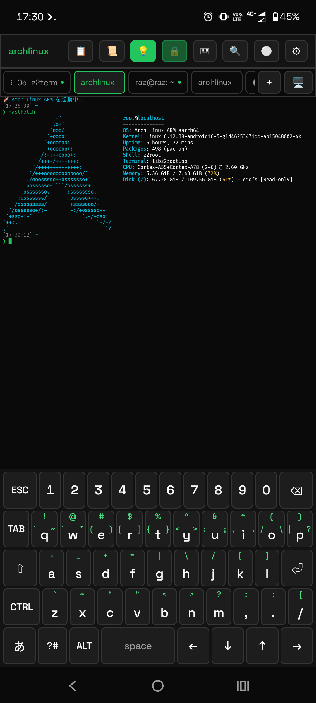
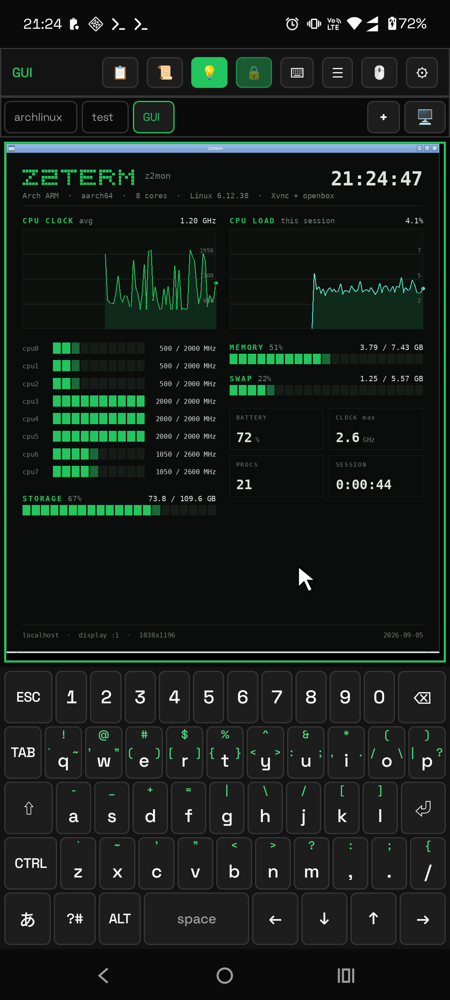

# Z2Term — Zero 2 Terminal

**English** ・ [日本語](README.ja.md)

[](https://github.com/orgsonai/z2term/releases/latest)
[](LICENSE)


### A terminal for Android that is also a way to drive Android.

Z2Term runs Alpine / Ubuntu / Arch / Kali **without root**, opens a **Linux desktop** in a tab,
and lets the shell reach the phone itself — read a notification, ask you a question in the
notification shade, or run a script when the battery, the network or an incoming SMS changes.

- **No root, no PC, no setup script.** Install one APK and you have a working distribution with `apk` / `apt` / `pacman`. The default execution engine (`z2root`) is a ptrace-based userspace implementation written for this app.
- **The shell can talk to Android.** Around 20 `z2-*` helpers (notifications, clipboard, sensors, torch, intents, alarms, wireless `adb` to the device itself) plus `z2-when` — an automation hub that runs scripts on device events and keeps working after a reboot without the app being opened.
- **Usable in Japanese.** A built-in kana-kanji IME with prediction and learning, which can also be turned on as an OS-wide input method.

> The 5th project of the Zero to Ship initiative.

## Screenshots

<table>
  <tr>
    <td align="center" width="50%"><br><sub>CUI — Arch Linux ARM terminal + custom keyboard</sub></td>
    <td align="center" width="50%"><br><sub>GUI — a desktop app on Xvnc</sub></td>
  </tr>
</table>

## Why another terminal app?

Android already has a mature terminal ecosystem, and Termux is the right answer if what you
want is the largest package repository and the most battle-tested tooling. Z2Term is built
around a different question: **what if the terminal were a first-class way to operate the
phone, and everything came in one APK?**

| | Z2Term | Termux + its add-ons |
|---|---|---|
| Full Linux distribution | Alpine / Ubuntu / Arch / Kali on z2root | `proot-distro` package installs one |
| Linux GUI | Built-in GUI tab (Xvnc + an RFB client inside the app), with audio and video. The same viewer also opens a **remote** VNC or RDP desktop | A separate X11, VNC or RDP viewer app |
| Drive Android from the shell | Built in — ~20 `z2-*` helpers | A separate companion app |
| Event-driven automation | Built in — `z2-when` (charging, battery level, time / cron, Wi-Fi, connectivity, boot, share, SMS, sensors, notifications, new files) with an Automation tab, logs and a kill switch | A separate companion app, usually paired with a third-party automation app |
| Japanese input | Built-in IME (conversion, prediction, learning), also selectable as the OS input method | The OS keyboard |
| SSH / SFTP, FTP, WebDAV and SMB clients, plus `sshd` | Built in; services use SSH port forwarding by default, SSH keys held by the Android Keystore | Install the packages yourself |
| Distribution | GitHub Releases (this repo) | F-Droid and its own repository |

Both are GPL-3.0 and neither collects telemetry. If you already have a Termux setup you are
happy with, Z2Term's reason to exist is the second, third and fourth rows of that table.

## Download

**You can download the latest APK directly from GitHub Releases** (no build needed):

- Go to the latest: **<https://github.com/orgsonai/z2term/releases/latest>**

Every release ships one APK: `z2term-<version>.apk`. See the release page for its size.

It bundles no OS and no third-party prebuilts, so **the first launch asks you to pick a distribution
in Settings › Linux environment** (0.8.314; Alpine is fetched from the official CDN, verified by
SHA-256, and updates never re-download it). Automatic updates (below) fetch the whole APK each time.

⚠ **Up to 0.8.358 there was a second, ~190MB APK with Alpine bundled (the `full` flavor).
0.8.359 dropped it** — it only saved that one first download, while making everyone choose between
two files. If you are on a `full` install, this APK updates it in place (same package ID).

Tap the APK on your Android device → allow "Install from unknown sources" to install.
(Not distributed on Google Play.)

### Keeping it updated

Pick whichever fits:

- **In-app update (0.8.371)** — *Settings → App info → Check for updates* → **"Download and install"**.
  It asks GitHub for the latest release **only when you tap the button** (nothing is checked
  automatically, and no network is touched until then), downloads the new APK and takes you all the way
  to the install screen. ⚠ Android always makes **the last tap yours** — no app can replace itself
  silently. The first time, allow "Install unknown apps" for z2term. From the terminal it is
  **`z2-update`** (`--check` / `--keep` / `--dir`). The downloaded APK is deleted after the update by
  default. ⚠ Installed from F-Droid or a store? Then it refuses and points you back there.
- **Manual** — download the newer APK from Releases and tap it (installs over the top; your data stays).
- **Automatic** — add `https://github.com/orgsonai/z2term` to
  [Obtainium](https://github.com/ImranR98/Obtainium). It watches these Releases and updates the app
  with one tap when a new version appears — no app store involved. The Linux OS is not downloaded again.

## Current version

**0.8.636-alpha (versionCode 644) — build and device verification pending at commit time**: Fixed the scope used to calculate the keyboard layout preview height, addressing a Kotlin compilation error. The preview remains fixed at the bottom, capped at 45% of the available height and 320dp. See the GitHub Release for publication-time verification results.

**0.8.635-alpha (versionCode 643) — build and device verification pending**: The RSS guide now registers named Automation rules for polling and notification actions, then opens the collected article list. Open targets the article; List opens the collected page. The guide includes permission for opening screens from notifications and where to edit existing rules. Tile/widget assignment and rss-open installation are no longer part of setup.

**0.8.634-alpha (versionCode 642) — build and device verification pending**: The keyboard layout preview is fixed at the bottom again, with Multiple selection beside it. Settings scroll above the visible keys; the heading, instructions and mode controls remain in the scrolling area. The preview has a height limit to retain room for editing in landscape and while typing. Extra key rows scroll within the preview. Selecting another key keeps the current settings scroll position, and the redundant Back to keys and Edit selected keys buttons are removed.

**0.8.633-alpha (versionCode 641) — build and device verification pending**: The keyboard layout editor scrolls its heading, instructions, mode controls and keyboard preview together. Only Cancel and Save stay at the bottom. Tap a key to reach its settings; Back to keys returns to selection. Multiple selection stays beside the preview, followed by Edit selected keys. Choices wrap, action buttons have touch targets of at least 48dp, occasional appearance and structure controls fold away, and reset/delete sit at the end of the page. Edge-panel Appearance starts with size and placement, with a scrolling diagram. Width and height separate numbers from units (screen percentage or dp), opacity uses percentages, and grid columns use a picker. Controls follow the selected handle shape and item flow, while coordinates sit in an advanced group. Hidden values are retained and invalid input identifies the affected setting. Save, discard and conflict checks remain in place.

**0.8.632-alpha (versionCode 640) — build unverified**: Notes in an edge panel can now be copied, cut and pasted (reported as "long-pressing selects but no menu appears, so I cannot copy or cut"). In a window drawn on top of other apps, text can be selected but Android's floating selection menu does not always appear. ⇒ While a note is being edited, **Cut, Copy and Paste** now sit right below the text. Cut and Copy are dimmed while nothing is selected. The labels come from Android itself, so they follow the phone's language. ⚠ **The system selection menu is left alone** — where it does appear, it still works.

**0.8.631-alpha (versionCode 639) — build unverified**: In the key-layout editor, **"Multiple selection" has moved onto the preview keyboard** (reported as "it sits at the top where it does not stay put, which is awkward"). It used to live in the scrolling settings column, so it slid out of sight as soon as you scrolled to a key's settings — exactly when you want it. It now sits next to the keys you tap, and while it is on, the number of selected keys is shown underneath. The duplicate count in the settings column is gone.

**0.8.630-alpha (versionCode 638) — build unverified**: Making a QR code no longer needs `qrencode` installed. The encoder (ZXing) is already in the app for the QR tools screen, so the terminal can now call the same one (`z2-qr encode`). `z2-qr encode "text"` writes a PNG (by default `~/.z2term/qr/qr.png`) and prints where it went; `-t` draws it right there with block characters instead. `-p` is the size to aim for in pixels and `-m` the quiet zone in modules. The bundled `qr.sh` keeps using `qrencode` when it is installed and falls back to the app when it is not, **so there is nothing to reinstall every time a tab (distro) is rebuilt.** ⚠ Where the app is out of reach (over `ssh`), `qrencode` is still required.

**0.8.629-alpha (versionCode 637) — build unverified**: A new bundled sample macro, `md.sh`, reads Markdown here on the terminal (the eleventh). `md.sh README.md` lays out headings, lists, tables, code and quotes on the screen; links stay tappable and pictures appear in place inside a tab (`z2-img`). `md.sh -v README.md` opens it in the reading screen (`z2-view`) added in 0.8.628. **Nothing to install** — `sh` and `awk` are enough. Lines wrap to the width of the screen and never start with a closing punctuation mark; a table too wide for the screen breaks into "heading: value" lines; and since this terminal does not draw italics, `*emphasis*` is underlined instead (as man does). Install it with `z2-macro install md`.

**0.8.628-alpha (versionCode 636) — build unverified**: New `z2-view` reads a page you built on the terminal **inside the app** — no server, no browser. `rss.sh` now writes such a page on every poll (the user's report: "following RSS through notifications is hard to read"). Notifications stay as they were, with a second button: Open sends that article to the browser, List opens everything collected, grouped by site, with an Open button on each article. From the terminal it is `rss.sh view`. The page is shown with JavaScript and network loads switched off, and follows the terminal's colours.

**0.8.627-alpha (versionCode 635) — build unverified**: Edge-panel scrolling no longer touches the screen by default. It used to send a real swipe, which an app cannot tell apart from your finger, so on screens where swiping does something that action ran instead, and a stroke across a keyboard could type (the user's report: "the gesture types characters by itself — it is dangerous"). ⇒ it now asks the scrollable view directly and only falls back to a swipe where the app offers nothing scrollable. Appearance → Gestures → How to scroll offers **Automatic / Do not touch the screen / Send a swipe** (`scroll-how=auto|node|swipe` from the CLI). The scroll target is also picked from the window you are touching: a freeform window may hold no input focus, which left it unscrollable even while in front.

**0.8.626-alpha (versionCode 634) — build unverified**: Two changes to the drawings `z2-icon` ships. (1) `sync` is redrawn as **two arrows forming a loop** — the old one did not read as anything in particular (the user's report: "sync has turned into a mark that makes no sense"). (2) **A camera drawing, `camera`, joins the list** (16 bundled now). A tile whose command contains `shot`, `photo` or `camera` gets it automatically (it is looked at before `moon`, because `screenshot` contains `screen`).

**0.8.625-alpha (versionCode 633) — build unverified**: Four fixes to `z2-shot`. (1) While you draw, the hint and shape controls at the foot are hidden so they do not sit on top of what you are framing; they return when you lift your finger. (2) The frequent "could not capture the screen" failure is fixed: automatic bar colouring samples the screen about once a second, and capturing right after that was refused by Android's minimum interval between screenshots, so the capture now waits out the remainder. (3) A Circle shape joins Free, Rectangle and Oval, using the shorter side of the drag as its diameter. (4) Dragging the image in the preview moves what is cropped.

**0.8.624-alpha (versionCode 632) — build unverified**: The + and gear buttons can now be placed at the top or the foot of a panel (Position of + and gear in panel settings, or `tools-place=top|bottom` from the CLI). Left automatic they behave as before: in the navigation row when a tab switcher is present, otherwise at the foot. A panel set to `tabbar=off` also no longer shows a tab switcher when it has child tabs — adding a single tab used to force the switcher into view and pull both buttons up with it.

**0.8.623-alpha (versionCode 631) — build unverified**: New `z2-shot` captures only the part you draw around. Called from an edge panel button, it hides the panel and its handle, takes one screen image, and lets you draw on that still picture. Free, rectangle and oval shapes are available, and lifting your finger confirms the outline (Redo draws it again). You then choose whether the outside is transparent or keeps the original background, and Save (to Pictures/z2term) or Share. The panel, its handle and the selection UI never appear in the saved image. Needs Android 11 or later and the z2term Android actions permission.

**0.8.620-alpha (versionCode 628) — build unverified**: The edge item editor is split into Component and behavior, Display, Command, Value and Connections, and blocks the chosen component does not use are hidden. Advanced settings and item size and position fold at the foot. Edit turns into Close while the editor is open and closes it again, asking first if there are unsaved changes. Manage › Remove panel or tab now uses checkboxes, so several panels and tabs can be deleted at once; ticking a panel deletes its tabs too. The guide card list scrolls, and a swipe no longer sends a card’s command. Japanese labels now use パネル consistently.

**0.8.619-alpha (versionCode 627) — build unverified**: Edge mini terminals retain shells, output and drafts across closing, tab changes and reloads. Output appends; ↻ resets manually. Outside taps and Back end active typing first and otherwise close the panel. Sample handles default to 30% opacity. Guide commands now send bulk paste and a final Enter in one ordered write.

**0.8.618-alpha (versionCode 626) — build unverified**: Panel bindings now show item names and support reordering and disconnecting. Buttons without a name or icon show Run. Result Stop/Copy/Clear controls are hidden by default and can be enabled in advanced settings. The single `edge-workspace` guide creates one panel with Notepad, Translation and Terminal tabs; translation requires a separately installed command and the bundled macro. Restores long-press repeat for letters, uppercase letters and symbols.

**0.8.617-alpha (versionCode 625) — build unverified**: Creation uses Add app and Add item. Select components and behaviors independently, bind arguments, standard input and output displays, and configure per-item dimensions, alignment and free placement. Existing items, files and scripts are retained. See [components and behaviors](docs/en/EDGE-MACRO-FORMS.md).

**0.8.615-alpha (versionCode 623) — build unverified**: Retains the 0.8.614 integration and corrects the unit-test syntax used by CI. Validation and distribution run on GitHub CI.

**0.8.614-alpha (versionCode 622) — build unverified**: The Linux engine now handles fd, cwd, namespace and memory-map magic links without interpreting their descriptions as filenames. This targets pipes, anonymous files, unlinked open files and working directories, and indirect executable references. Translation forms and mini terminals also receive outside long presses to open settings. Outside taps and Back keep these panels open; the panel captures outside touches. When the translation CLI is missing, the wrapper prints manual installation commands for the current distribution. Also fixes the translation macro icon mapping and Japanese weekday/clock parsing in byte-oriented shells and locales. Verification on the updated device is pending.

**0.8.613-alpha (versionCode 621)**: Horizontal flicks over terminal and translation results switch tabs while vertical drags still scroll output. Up/Down in the mini terminal recall the regular shell history. The action-row ≡ button opens existing snippets for selection, registration, editing and deletion, using the same data as the main app. Selection inserts a command; Run executes it.

**0.8.612-alpha (versionCode 620)**: Edge-panel tabs and Close keep the same position across pages, without switching window geometry. Mini-terminal input sits at the bottom; blank labels omit headings. Terminal and translation results scroll inside their result boxes, and the persistent help text is removed. Items can be deleted directly from the list, preserving its scroll position.

**0.8.611-alpha (versionCode 619)**: Edge panels support independent argument boxes, macro actions and result boxes. Bind text, choices or fixed values in argument order; clear, copy or stop results. A translation template uses the same form mechanism. Users install the translation CLI themselves; no SDK, model or automatic download is added to the APK. [Usage](docs/en/EDGE-MACRO-FORMS.md).

**0.8.610-alpha (versionCode 618)**: Edge panels now offer a mini terminal with one-line commands and live output cleared before each run. Directory and environment changes last only for the current opening; closing also stops ordinary jobs. Explicit `nohup` jobs and detached `tmux` / `screen` sessions can continue. Outside taps and Back keep the panel open; use its Close button. No external dependencies were added. [Usage](docs/en/MINI-TERMINAL.md).

**0.8.609-alpha (versionCode 617)**: The reminder macro accepts a weekday for a single upcoming reminder, including Japanese input such as `土曜日の夜九時` (Saturday at 21:00). Japanese morning/night expressions, kanji numerals and full-width digits are supported. A later time on the same weekday means today; a time already reached means next week. [Syntax and updating an installed macro](docs/en/MACRO-GUIDE.md).

**0.8.608-alpha (versionCode 616)**: `z2-share --file` sends file contents through Android's share sheet. Incoming text and attachments are saved as one receipt, with an optional choice of registered snippets. Snippets can request text, numbers, choices and files, preview the command, then insert it for execution with Enter. [Sharing and command input guide](docs/en/SHARE-WORKFLOW.md).

**0.8.607-alpha (versionCode 615)**: The call macro now describes its actual purpose: a notification to copy a phone number. It includes saved and unsaved callers whenever the title or body contains a bare number. The existing name `unknown-call` and automation rules remain compatible. Installed copies are not updated automatically: after updating the app, inspect `z2-macro diff unknown-call` and, if you have no custom edits to preserve, replace the copy with `z2-macro install -f unknown-call`.

**0.8.606-alpha (versionCode 614)**: Added Korean, Spanish, Simplified Chinese and Traditional Chinese strings for foreground-screen automation, recording, gestures and placement, fixing missing-translation lint errors. Updated the public pages to the current version.

**0.8.605-alpha (versionCode 613) — build not verified**: Action automation can record a whole sequence of taps, swipes and two-finger touches until stopped. Choose a recording surface or live recording through root. Only leading/trailing idle time is trimmed; pauses and timed paths are retained. Manual acceleration/deceleration, double tap, pinch in/out and two-finger swipe are also available. Place saved macros in Quick Settings tiles or edge panels. Device behavior is not verified.

**0.8.605-alpha (versionCode 613) — build not verified**: Action automation can save taps, scrolling and UI-element steps without selecting an app. GUI Run moves z2term to the background and operates the foreground screen. Explicit app targets remain available; `target current` returns to foreground-screen operation. [Usage](docs/en/ACTION-MACROS.md).

**0.8.604-alpha (versionCode 612)**: Moved each connection’s QR button to the end of its action row. Buttons appear in this order: SSH, SFTP, added services, then QR.

**0.8.603-alpha (versionCode 611)**: QR tools keep a history of what you scan. Tap an entry to show it again, or long-press it to pin or delete it; Clear all keeps pinned entries. Turning edge panels on no longer creates a panel by itself. Instead, the edge-panel guide gains one step that creates the same sample app panel: one line of the existing `z2-edge panel` and `z2-edge set` commands, built from the apps found on the device. The Action automation tab now matches the other command sheet tabs: monospace headings and text, bordered rows with ▶, Duplicate, ✎ and ✕ actions, bordered buttons, hint boxes and dialogs in the app's colours.

**0.8.602-alpha (versionCode 610)**: After a scan, QR tools show one Open button matching the content. URLs open in their app, such as LINE, or in a browser; phone numbers open the dialer; mail and SMS open a compose screen; Wi-Fi opens the connection screen; contacts and events open an add screen. Nothing opens by itself. z2term commands and SSH endpoints keep their review screen. The QR entry moved from the Snippets and Connections headers to Settings › QR tools and the new `z2-qr` command, which starts with the camera scanning. `z2-qr` can be assigned to a quick-settings tile or an edge panel.

**0.8.601-alpha (versionCode 609)**: The QR tools entry moved from the top of the command sheet to the Snippets and Connections tab headers, next to “+ New”. The top is again only the drag handle, which closes the sheet when tapped. QR tools and Share files through a relay now use the command sheet's monospace text, bordered buttons and fields. The relay entry at the bottom of the Servers tab is now a bordered row with a chevron. Turning edge panels on with no panels creates an app list opened from a bar on the right edge. It lists the z2term, browser, camera, phone, messages and settings apps found on the device. Settings › Maintenance › Show a guide adds “edge-panel”, covering the overlay and accessibility permissions, turning the panel on and long-pressing outside the menu to open settings.

**0.8.600-alpha (versionCode 608)**: QR tools remain available. File sharing now requires a self-hosted relay, with a small “Share files through a relay” entry at the bottom of the Servers tab. Choose a saved SSH profile and configure your own public HTTPS origin and server-side loopback port. Automatic third-party relays and direct device-address sharing have been removed. The QR appears after the public URL passes a health check. Stop, expiry or network change closes the share connections and removes the sending copy.

See [QR tools and self-hosted relay setup](docs/en/QR-TOOLS.md) for setup and public-access requirements.

**0.8.597-alpha (versionCode 605)**: QR tools open from the top-left of the command sheet. They read camera frames and images, offer reviewed URL opening, import SSH endpoints and short commands, and display content as QR codes. The separate “z2term — QR” share target also accepts QR images and decoded text from other apps. Automation places Rules on the left and Action automation on the right; Rules remains selected by default. The direct device-address sharing added in this version was removed in 0.8.600.

**Startup race fix (0.8.596)**: A theme initialization crash found after the device update is addressed by constructing the shared palette during Application startup and applying the asynchronously loaded theme on the main thread. This prevents composition from racing with the first creation of palette state.

**0.8.595-alpha (versionCode 603)**: The edge panel Manage page now displays recreation commands with a Copy commands button. It exports saved settings and items as `z2-edge` commands. Selecting a parent includes its tabs and their order; selecting a child preserves existing parent settings and other tabs. Note contents, referenced scripts and images need separate backups.

**0.8.594-alpha (versionCode 602)**: The Android system shell now starts without a Linux installation. Android `z2-*` helpers, automation, edge panels, tiles and widget commands can run using the shared home. `z2help` lists the supported scope. Existing Linux execution paths are preserved; Linux packages and the audio/image helpers still require Linux. The selected OS can also be deleted after confirmation; removing the last OS moves affected tabs to the Android shell and keeps shared home.

Also includes temporary notification diagnostics through `z2-noti trace`, recording types and lengths of received fields and extracted text without retaining text values. Missing notification text remains under investigation.

## Features

- **Floating edge panels** — Six handle gestures share GUI-editable action sequences (app launch, waits, commands and single swipes), plus auto-scroll speed/reversal/position controls in the focused Android window. Taps stop scrolling. Thin bars restore after screen unlock and support configurable activation and hold-to-drag snapping; panels offer an app picker, custom macro/command slots with z2-icon selection, swipe tab switching, inline item editing, cancellable size/opacity previews, rotation-aware positioning and service toggling. `z2-edge` defines an edge bar or draggable button and panels with command buttons, text, toggles, lists and input fields. Shell commands supply the contents; `push` and `badge` update them from automation. `z2-key` exposes Android global actions through an optional accessibility service, and `z2-app` lists launchable apps and exports their icons. See [the handbook](docs/en/HANDBOOK.md#96-floating-edge-panels). Overlay permission is opt-in; no external helper app is required.
- **Terminal emulator** — VT100 / xterm, 256-color and true color, 9 themes, scrollback with search, UTF-8 and East Asian Width, alternate screen, OSC 4 / 7 / 8 / 10 / 11 / 12 / 52.
- **Linux distributions without root** — Alpine / Ubuntu / Arch / Kali on a userspace engine (z2root by default; see below). Install anything with `apk` / `apt` / `pacman`.
- **Execution engine** — fully migrated to z2root for non-root use; rooted devices may optionally use the hidden chroot path.
- **USB Host bridge** — use a USB device connected to the phone from ordinary dynamically linked Linux programs. Run `z2-usb list`, then `z2-usb allow [number]` and approve Android's device permission; programs using libusb or `/dev/bus/usb/...` can then open it without being patched. A normal data-capable USB-A-to-USB-C adapter or hub works when the phone supports USB Host/OTG.
- **Multi-tab** — CUI and GUI tabs, drag to reorder, long-press a tab to see the engine it runs on. An inactive tab shows a small dot while something is running in it, and a ✓ when it finished while you were looking elsewhere.
- **Linux GUI** — Xvnc + openbox with a built-in RFB client; `z2gui` starts a desktop and `z2run <app>` launches a GUI app (opening the GUI tab for you), with audio and video. The same viewer also connects to a **remote VNC or RDP desktop**: a saved host gets **[VNC]** and **[RDP]** buttons that open that machine's desktop in a tab (VNC: RFB 3.3-3.8, None / VNC-password auth; RDP: Network Level Authentication with a first-use certificate check, mouse and keyboard input, text clipboard sharing, and **sharing one folder from the phone** as `\\tsclient\<name>`).
- **SSH / SFTP, FTP, WebDAV and SMB2/3** — add FTP, SMB, WebDAV, VNC and RDP services to an SSH destination; their buttons sit beside, rather than inside, SSH/SFTP. Each service uses a temporary SSH local forward by default, and leaving its local port blank selects a free port automatically. Direct mode connects to the SSH destination host rather than the service-specific host and is available only after a warning that SSH encryption will be lost. FTP passive data ports are forwarded automatically per transfer. SSH also provides public-key auth (**create an ed25519 key in the app, then copy/share the public key or add it to this device's sshd**; secrets encrypted by the Android Keystore), known_hosts confirmation, **any number of jump hosts (`-J`) per destination** — they apply to the shell, SFTP, every attached service and resident tunnels alike — manual forwarding in both directions (`-L` / `-R`) that can **keep running after the Connections tab is closed**, and a built-in `sshd` (dropbear) that binds to localhost only by default.
- **English, Japanese, Simplified and Traditional Chinese, Spanish and Korean throughout** — the in-app UI *and* the `z2-*` command-line helpers follow the language setting, so the help text, usage lines and messages you get in the terminal are localized too. Both bodies of text are keyed by language code, so further languages drop in without touching the code that uses them; anything not translated yet falls back to English. ⚠ The keyboard is a separate matter: no Chinese input method is bundled, so type Chinese with your OS input method.
- **Japanese IME** — Viterbi kana-kanji conversion, prediction, frequency/recency learning, and a custom on-screen keyboard. It can also be **offered as an OS input method**, so once enabled the same keyboard and conversion work in the app's own text fields and in other apps (switching is the OS keyboard switcher). **Your own words can be added from a file** (SKK format: `reading /candidate/`), so names and private abbreviations convert from the first keystroke.
- **Modified terminal keys** — send Alt/Ctrl/Shift with arrows, Home/End, editing keys and F1–F12 from the built-in or physical keyboard. Custom key chords and the special-key bar share the same terminal encoding.
- **Android bridge** — call host features from the shell: `z2-noti` (read the notifications on screen; read-only) / `z2-notify` / `z2-toast` / `z2-share` / `z2-open` / `z2-img` (draw a picture straight in the terminal) / `z2-clip` / `z2-battery` / `z2-vibrate` / `z2-say` / `z2-torch` / `z2-media` / `z2-volume` / `z2-sensor` / `z2-intent` / `z2-state` / `z2-screen` (stop the screen turning off by itself, for a while) / `z2-usb` / `z2-tile` (put a macro on a quick-settings tile; 12 slots) / `z2-icon` (draw the status-bar and tile icons yourself) / `z2-alarm` / `z2-macro` / `z2-session` (drives the app's own tabs; `attach` stays connected to one and types in it) / `z2-server` (start/stop a registered resident server).
- **It can ask you things** — `name=$(z2-ask "Branch name?")` takes the answer from a **notification reply field** (answerable from the shade without opening the app; no answer means a non-zero exit, so "give up" is expressible).
- **Automation hub** — `z2-when <trigger> run <cmd>` auto-runs a script on Android events: charge start/stop, battery crossing a level, a time (daily / once / every N / cron), Wi‑Fi connect/disconnect, **a usable connection appearing/going away or the link in use switching (`net:online` / `net:mobile` — mobile data counts too)**, **the device booting (`boot`)**, **something being shared to it from another app (`share:ext=pdf` …)**, an incoming SMS (incl. OTP code extraction), a sensor (shake / light threshold / proximity), **an arriving notification (`notify:otp` extracts the code; independent of whether notifications are logged)**, **any device event by name (`event:headset_plugged` and ~20 more; `z2-when events` lists them)**, or **a new file appearing in a folder (`file:new=…`)**. Rules can be **narrowed with filters** (`if=ssid=Home` / `cooldown=1h` / `between=22:00-07:00` / `days=mon-fri` — they work the same for every trigger, and skipped runs stay in the log as `skip:`). Rules are plain text under `~/.z2term/when/` (git-syncable) and survive reboots without opening the app. The **Automation tab** (📜) lists them with on/off toggles, run logs and a **▶ run-now** that skips the trigger, plus a **kill switch that pauses every rule** and a list of recent fires (`z2-when pause` / `resume` / `fired` in the terminal).
- **Resident servers** — register any start command under *Command list → Servers* and it keeps running in the background **without the app being open**: host a small web server, a sync daemon or a bot from the phone. The Status widget shows how many are up, and registered servers are restarted on boot.
- **Self adb** — `z2adb` connects to the device's own wireless debugging over localhost. No PC, USB, or root.
- **App lock** — asks for your fingerprint, face, or screen lock (PIN/pattern) before the screen appears. Choose when it locks (at once / after 30s / after 1 min / after 5 min / on launch only); while you are away the recent-apps thumbnail is hidden too. Sessions, resident servers and `z2-session attach` keep running while locked, so nothing left working overnight is broken.
- **Built-in help** — `z2help` (or `z2term`) prints a categorized cheat sheet of every `z2*` helper, and every command explains itself with `--help` (e.g. `z2-tile --help`); `z2version` shows the app version and the engine the tab is really running on.
- **`z2doctor`** — one command that answers "why isn't it working?": version, engine, free space, every permission the app needs, detection and automation state. **Each `NG` line carries the next step**, and the end is a short report you can paste into an issue (`--share` / `--clip`). SSIDs, IPs and host names are left out on purpose.
- **Vulnerability testing** — `z2scan self` audits this device/localhost (open ports, sshd config, SSH key perms, world-writable/SUID, PATH) with no external tools; `z2scan net/host/cve` wrap nmap/lynis/trivy on localhost (a remote target requires explicit opt-in). Results stay local.
- **Terminal log** — tap ⚪ in the toolbar once to start writing what the tab shows to a text file, tap again to stop. Files land in `~/z2term-log/`, so they open straight from the shell or from other apps. By default colors and screen control codes are stripped so the result reads as plain text.
- **Home screen widgets** — *Status & launcher*: shows the state as running/registered counts (ssh endpoint / resident servers / automation rules / battery) and runs a macro you picked **in the background with one tap, without opening the app**; tap a running macro again to stop it. *Live tail*: keeps the last or the first lines of any file under `~` on your home screen (`tail` or `head`, your choice).
- **Data limit** — once **the whole phone's** mobile usage for the period hits the amount you set, z2term's own traffic (SSH, downloads) stops. Set the limit with the slider or type it exactly. ⚠ Your home network (`192.168.x.x` and friends) and anything over Wi-Fi keep working, and other apps are untouched (reading the device-wide figure asks for the "usage access" permission once).
- **Snippet groups** — sort the commands you use most onto shelves ("daily", "git", …) and list only what is on the shelf you tapped, so nothing sinks out of reach as they pile up. Deleting a shelf keeps its snippets (they move back to ungrouped).
- **Take it with you** — bundle settings, SSH connections, snippets, automation rules, macros, your theme, tile assignments, icons, dictionaries and what the keyboard has learned into one file and restore them on another device. The OS image is excluded. **SSH secrets are left out by default; including them requires a passphrase.** In that case the **whole backup except its manifest is encrypted**, including snippets, macros and learned text that may themselves contain secrets. It can also **write one on a schedule** (interval, time, folder and generations to keep) — only the files it made are tidied up, never one you created by hand. Give the scheduled backup a **passphrase and its contents are encrypted too**, still without carrying any SSH secret (0.8.452; left empty it stays plaintext as before).
- **First-run cards** — three small cards on the first launch (post a notification / flashlight / let a PC connect). Tapping one **puts the command on the input line — it never runs by itself**; they disappear once tapped and never return.
- **Receive from Share** — pick z2term in another app's share sheet and the text (or, for files, a path under `~/z2term-inbox/`) is **inserted** on the terminal's input line — never executed.
- **Tidy toolbar** — choose which buttons appear from settings (⚙ settings stays pinned to the right edge); long-press and drag to reorder, **either on the toolbar itself or in settings**.
- **No prebuilts, one download** — a single APK that bundles no third-party prebuilts; the distribution is downloaded at first launch and verified by SHA-256.

### Not yet supported / under consideration

- mosh protocol support (UDP-based)
- Reverse DNS / stronger IPv6 connection retry
- Fully self-contained z2root engine with no third-party native prebuilts

## Build requirements

| Item | Version |
|---|---|
| Android Studio | Ladybug 2024.3.1 or later |
| AGP | 9.1.1 |
| Kotlin | 2.2.10 (bundled with AGP) |
| Gradle | 9.3.1 |
| NDK | 27.0+ |
| CMake | 3.22.1+ |
| Other tools | Python 3, curl, tar, sha256sum |
| Min SDK | 29 (Android 10) |
| Target SDK | 35 (Android 15) |

## Setup

### 1. Collect the git-ignored bundled artifacts (one command)

Several artifacts are bundled into the APK but **kept out of git** (built/fetched by `scripts/`), so a fresh `clone` or a `clean` has none of them. Collect them with the master script on a PC:

```bash
bash scripts/build-bundle.sh
```

It runs two generators and verifies the common payload:

1. `build-z2root.sh` → `libz2root.so` / `libz2accept.so` (needs an NDK)
2. `fetch-fonts.sh` → `IBMPlexMono` / `JetBrainsMono` / `FiraCode` `-Regular.ttf`

A final manifest step prints `OK` / `MISS` per artifact. Linux rootfs archives are downloaded at runtime and are never APK build inputs.

Per-artifact details: [app/src/main/assets/README.md](app/src/main/assets/README.md) · [app/src/main/jniLibs/README.md](app/src/main/jniLibs/README.md)

### 2. Build

```bash
./gradlew assembleRelease
# Output: app/build/outputs/apk/release/app-release.apk
```

(No signing key required for forks — `build.gradle.kts` falls back to the debug key when `keystore.properties` is absent.)

### 3. Install

```bash
adb install -r app/build/outputs/apk/release/app-release.apk
```

## Project structure

```
z2term/
├── app/
│   ├── build.gradle.kts
│   └── src/main/
│       ├── AndroidManifest.xml
│       ├── assets/                  ← place the Alpine rootfs here
│       ├── cpp/                     ← JNI native code
│       │   ├── CMakeLists.txt
│       │   └── pty_jni.cpp
│       ├── java/com/zerotoship/z2term/
│       │   ├── Z2TermApplication.kt
│       │   ├── MainActivity.kt
│       │   ├── channel/             ← ProcessChannel / SshChannel (M5)
│       │   ├── core/                ← TerminalSession + SessionManager
│       │   ├── pty/                 ← PTY abstraction
│       │   ├── proot/               ← Linux launch (legacy package name)
│       │   ├── distro/              ← rootfs deployment (Alpine + Ubuntu)
│       │   ├── emulator/            ← VT100/xterm emulator core
│       │   ├── settings/            ← DataStore persistence
│       │   ├── service/             ← TerminalService / AudioBridge (foreground + WakeLock)
│       │   ├── gui/                  ← GUI (Xvnc + built-in RFB client / GuiSession)
│       │   ├── saf/                  ← SAF DocumentsProvider
│       │   └── ui/
│       │       ├── theme/           ← ZTS Theme + custom fonts
│       │       ├── settings/        ← settings UI
│       │       ├── ssh/             ← SSH profile UI (M5)
│       │       └── terminal/        ← terminal UI + Renderer + key mapper
│       ├── jniLibs/                 ← generated z2root binaries
│       └── res/                     ← resources
├── build.gradle.kts
├── settings.gradle.kts
├── gradle/
│   ├── libs.versions.toml
│   └── wrapper/
├── docs/
│   ├── ja/                        ← Japanese documentation
│   │   ├── DESIGN-SPEC.md         ← design & specification (technical)
│   │   ├── HANDBOOK.md            ← user handbook
│   │   └── MACRO-GUIDE.md         ← phone-automation macro guide (AI-friendly)
│   ├── en/                        ← English documentation
│   │   ├── DESIGN-SPEC.md         ← design & specification
│   │   ├── HANDBOOK.md            ← getting started handbook
│   │   └── MACRO-GUIDE.md         ← phone-automation macro guide (AI-friendly)
│   ├── images/                    ← screenshots etc. (shared)
│   ├── RELEASE.md                 ← release steps
│   ├── FDROID.md                  ← F-Droid submission steps
│   └── SSH-INTO-Z2TERM.md
├── metadata/                     ← F-Droid metadata (store listing)
└── .github/workflows/build.yml   ← CI (build, lint, tests, signed release APK)
```

## Build variants

Only build types differ. The distribution flavors (`full` / `foss`) were dropped in 0.8.359 —
one build for everyone, with the rootfs always fetched at runtime.

| Build type | applicationId | Launcher name |
|---|---|---|
| `release` | `com.zerotoship.z2term` | `Z2Term` |
| `debug` | `com.zerotoship.z2term.debug2` | `Z2Term dbg2` |

The suffix lets a debug build sit next to a release one, and the name tells them apart.

```bash
./gradlew assembleDebug
```

## Smoke-test flow

1. Build and install; select an OS and complete the runtime download.
2. Confirm `z2version` reports `engine : z2root`, then test the distro package manager.

### z2root command-group test (`scripts/z2root-cmdtest.sh`)

A regression smoke test for confirming that **fragile commands keep working
going forward** on the z2root engine — focused on the hard paths (ptrace/seccomp,
fakeroot fakery, path translation, `/proc` fakery, pty, heavy fork/exec, ld.so
reloc), not trivial `cd`/`ls`. The point is to catch a systemic z2root regression
as "many commands fail at once" instead of discovering each broken command later.
Run it inside a started guest (any distro) on the z2root tab:

```sh
sh scripts/z2root-cmdtest.sh              # standard (incl. network/build)
SKIP_NET=1   sh scripts/z2root-cmdtest.sh # skip network/package steps
SKIP_BUILD=1 sh scripts/z2root-cmdtest.sh # skip cc compile etc.
RUN_SSHD=1   sh scripts/z2root-cmdtest.sh # dropbear loopback ssh (may reset the session under z2root!)
RUN_PRIV=1   sh scripts/z2root-cmdtest.sh # also run truly-root ops (losetup/mount); EPERM is normal on non-root z2root
```

It is POSIX `sh` / busybox-ash compatible and **skips missing commands rather than
failing**, so it runs identically across distros — run it on each guest and a
healthy engine yields an empty "non-zero exit" summary everywhere. 10 groups:
① runtime real-launch (`claude` headless vs `--version`, node spawn, python
venv/multiprocessing/ssl, ripgrep), ② heavy VCS (git clone/gc/checkout =
hardlink/pack/rename), ③ package managers (apt/apk/dnf/pacman, pip/venv, npm =
fakeroot/fork-exec/symlink), ④ pty/terminal (script/tmux/stty, `/dev/pts`,
optional dropbear loopback), ⑤ `/proc`/fakeroot boundary, ⑥ build (cc execve
chain + ld.so reloc), ⑦ path translation / symlink canonicalization, ⑧ disk/FS
(dd, mkfs, parted on file images; root ops behind `RUN_PRIV`), ⑨ IPC / special
syscalls (AF_UNIX, FIFO, flock, inotify, xattr, copy_file_range, nested ptrace
via strace/gdb, Go raw syscalls, sqlite3, rsync), ⑩ name resolution / TLS
(getent, curl TLS, nslookup). Output goes to the screen and
`/tmp/z2root-cmdtest-<timestamp>.log`; a trailing summary lists any non-zero
exits.

Note: `io_uring` (bypasses ptrace/seccomp entirely) and `statx`/`openat2` hook
gaps can't be caught by command tests — verify those at the seccomp-filter level.

## License

The license of the app itself (`app/src/main/java/com/zerotoship/z2term/**`) is **GPL-3.0**.
Copyright (c) 2026 Zero to Ship. Corresponding source (GPL v3 §6): <https://github.com/orgsonai/z2term> (full text in the root `LICENSE`).
Bundled third-party notices are available from Settings → OSS licenses.

## Bundled OSS and corresponding source

| Bundled item | License | How to get the corresponding source |
|---|---|---|
| AndroidX / Jetpack Compose | Apache-2.0 | [Android Open Source Project](https://android.googlesource.com/) |
| Kotlin Standard Library / Coroutines 1.7.3 | Apache-2.0 | [JetBrains/kotlin](https://github.com/JetBrains/kotlin) / [kotlinx.coroutines 1.7.3](https://github.com/Kotlin/kotlinx.coroutines/tree/1.7.3) |
| JSch / JZlib / jBCrypt | BSD-3-Clause / ISC | [mwiede/jsch](https://github.com/mwiede/jsch) / [ymnk/jzlib](https://github.com/ymnk/jzlib) / [jBCrypt](https://www.mindrot.org/projects/jBCrypt/) |
| OkHttp 5.3.0 | Apache-2.0 | [square/okhttp](https://github.com/square/okhttp) |
| Okio 3.16.2 | Apache-2.0 | [square/okio 3.16.2](https://github.com/square/okio/tree/3.16.2) |
| SMBJ 0.15.0 | Apache-2.0 | [hierynomus/smbj v0.15.0](https://github.com/hierynomus/smbj/tree/v0.15.0) |
| asn-one 0.6.0 | Apache-2.0 | [hierynomus/asn-one v0.6.0](https://github.com/hierynomus/asn-one/tree/v0.6.0) |
| MBassador 1.3.2 | MIT | [bennidi/mbassador](https://github.com/bennidi/mbassador) |
| SLF4J API 2.0.18 | MIT | [qos-ch/slf4j v2.0.18](https://github.com/qos-ch/slf4j/tree/v_2.0.18) |
| Bouncy Castle 1.85.2 | MIT | [bcgit/bc-java r1rv85v2](https://github.com/bcgit/bc-java/tree/r1rv85v2) |
| XZ for Java | 0BSD | [Tukaani XZ for Java](https://tukaani.org/xz/java.html) |
| Guava ListenableFuture 1.0 | Apache-2.0 | [google/guava](https://github.com/google/guava) |
| JetBrains Java Annotations 23.0.0 | Apache-2.0 | [JetBrains/java-annotations](https://github.com/JetBrains/java-annotations) |
| Fira Code / IBM Plex Mono / JetBrains Mono | OFL-1.1 | [tonsky/FiraCode](https://github.com/tonsky/FiraCode) / [IBM/plex](https://github.com/IBM/plex) / [JetBrains/JetBrainsMono](https://github.com/JetBrains/JetBrainsMono) |
| SKK-JISYO.L (source of the bundled dictionary `z2dict.txt`) | GPL-2.0-or-later | [skk-dev/dict](https://github.com/skk-dev/dict) |
| IPADIC (mecab-ipadic 2.7.0-20070801; source of `kkc_lex.tsv` / `kkc_matrix.bin`) | NAIST license | [taku910/mecab](https://github.com/taku910/mecab) |
| Japanese Wikipedia (source of the co-occurrence data `kkc_colloc.bloom`) | CC BY-SA 4.0 | [jawiki dumps](https://dumps.wikimedia.org/jawiki/) |

From the settings screen → "OSS licenses / corresponding source", you can also browse/show this in-app
(license full texts are placed in `assets/licenses/`).

## Distribution policy

| Channel | Status |
|---|---|
| **GitHub Releases / direct APK** | Primary channel; one APK per release |
| **F-Droid** | Runtime-downloaded rootfs; fully source-built engine |
| **Google Play** | No distribution planned |

## Default behavior of the SSH server (sshd)

The in-terminal `sshd` command starts by default with **127.0.0.1-only bind + key auth only**
(dropbear wrapper, `SshdScript.kt`). To expose it on LAN/WAN, explicitly:

```sh
sshd --lan          # bind all NICs; refuses to start if ~/.ssh/authorized_keys is empty
Z2_SSHD_LAN=1 sshd  # also works via env
```

## Related

- [Zero to Ship Project](https://github.com/orgsonai)
- [Termux](https://github.com/termux/termux-app) - reference implementation
- z2root — source-built userspace Linux engine included in this repository
- [Alpine Linux](https://alpinelinux.org/) - main distro
