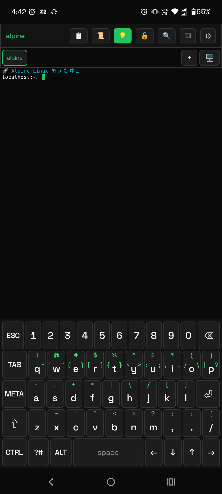
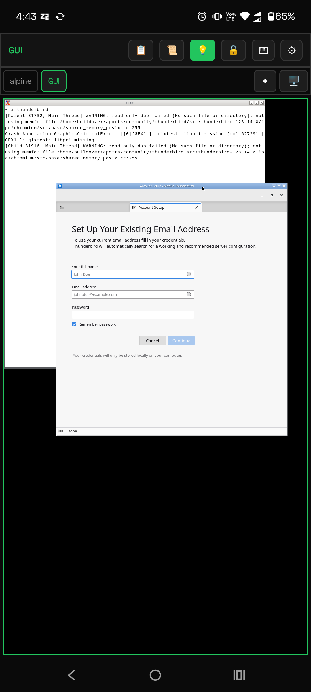

# Z2Term — Zero 2 Terminal

**English** ・ [日本語](README.ja.md)

**Z2Term** is a custom-built terminal app that runs on Android.
It runs several Linux distributions (Alpine / Ubuntu / Arch / Kali) via PRoot,
and lets you install any command through package managers like `pacman` / `apt`.

> The 5th project of the Zero to Ship initiative.
> Blog: https://zero-to-ship-app.vercel.app

## Screenshots

<table>
  <tr>
    <td align="center" width="50%"><br><sub>CUI — Alpine terminal + custom keyboard</sub></td>
    <td align="center" width="50%"><br><sub>GUI — Thunderbird running on Xvnc</sub></td>
  </tr>
</table>

## Download

**You can download the latest APK directly from GitHub Releases** (no build needed):

- Go to the latest: **<https://github.com/orgsonai/z2term/releases/latest>**

Tap the APK on your Android device → allow "Install from unknown sources" to install.
(The `full` flavor bundles prebuilts, so the APK works standalone. Not distributed on Google Play.)

## Current version

**0.8.123-alpha (versionCode 131).** The latest APKs and the full release history live on **[GitHub Releases](https://github.com/orgsonai/z2term/releases)**.

## Features

- **Terminal emulator** — VT100 / xterm, 256-color and true color, 6 themes, scrollback with search, UTF-8 and East Asian Width, alternate screen, OSC 4 / 7 / 8 / 10 / 11 / 12 / 52.
- **Linux distributions without root** — Alpine / Ubuntu / Arch / Kali via PRoot. Install anything with `apk` / `apt` / `pacman`.
- **Execution engines** — z2root (default; a ptrace-based engine that needs no root), PRoot, and chroot (rooted devices). The engine selector unlocks by tapping the version 7 times.
- **Multi-tab** — CUI and GUI tabs, drag to reorder, session restore after the OS kills the app.
- **Linux GUI** — Xvnc + openbox with a built-in RFB client; run desktop apps such as Thunderbird or mpv, with audio and video.
- **SSH / SFTP** — public-key auth with secrets encrypted by the Android Keystore, known_hosts confirmation, file transfer, and a built-in `sshd` (dropbear) that binds to localhost only by default.
- **Japanese IME** — Viterbi kana-kanji conversion, prediction, frequency/recency learning, and a custom on-screen keyboard.
- **Android bridge** — call host features from the shell: `z2-notify` / `z2-toast` / `z2-share` / `z2-open` / `z2-clip` / `z2-battery` / `z2-vibrate`.
- **Self adb** — `z2adb` connects to the device's own wireless debugging over localhost. No PC, USB, or root.
- **Built-in help** — `z2help` (or `z2term`) prints a categorized cheat sheet of every `z2*` helper; `z2version` shows the app version and the engine the tab is really running on.
- **Vulnerability testing** — `z2scan self` audits this device/localhost (open ports, sshd config, SSH key perms, world-writable/SUID, PATH) with no external tools; `z2scan net/host/cve` wrap nmap/lynis/trivy on localhost (a remote target requires explicit opt-in). Results stay local.
- **FOSS flavor** — bundles no third-party prebuilts; the distribution is downloaded at first launch and verified by SHA-256.

### Not yet supported / under consideration

- Local port forwarding (-L) / reverse forwarding (-R)
- mosh protocol support (UDP-based)
- Reverse DNS / stronger IPv6 connection retry
- Fully self-contained proot replacement to drop all third-party native notices (FOSS-PURE phase 2)
- IME learning-history reset UI / backup

## Build requirements

| Item | Version |
|---|---|
| Android Studio | Ladybug 2024.3.1 or later |
| AGP | 9.1.1 |
| Kotlin | 2.2.10 (bundled with AGP) |
| Gradle | 9.3.1 |
| NDK | 27.0+ |
| CMake | 3.22.1+ |
| Min SDK | 29 (Android 10) |
| Target SDK | 35 (Android 15) |

## Setup

### 1. Collect the git-ignored bundled artifacts (one command)

Several artifacts are bundled into the APK but **kept out of git** (built/fetched by `scripts/`), so a fresh `clone` or a `clean` has none of them. Collect them all with a single master script — this is the only way to gather them, so every machine (PC or phone) ends up with the same set rather than each assembling a different mix:

```bash
bash scripts/build-bundle.sh
```

It runs all four generators in order and then verifies nothing is missing:

1. `build-proot.sh` → `libproot.so` / `libproot_loader.so` / `libtalloc.so` / `libandroid-shmem.so`
2. `build-z2root.sh` → `libz2root.so` / `libz2accept.so` (needs an NDK; auto-resolved from `local.properties` `sdk.dir`+`ndk.version`)
3. `fetch-fonts.sh` → `IBMPlexMono` / `JetBrainsMono` / `FiraCode` `-Regular.ttf`
4. `build-alpine-rootfs.sh` → `app/src/full/assets/alpine-minirootfs-aarch64.tgz` (`full` flavor only; `foss` downloads it at runtime)

A final manifest step prints `OK` / `MISS` per artifact and exits non-zero if anything is missing. On a host where `fakeroot` cannot build the rootfs, run `SKIP_ROOTFS=1 bash scripts/build-bundle.sh` (collect everything else) and bring the rootfs `.tgz` over from a machine that can build it.

Per-artifact details: [app/src/main/assets/README.md](app/src/main/assets/README.md) · [app/src/main/jniLibs/README.md](app/src/main/jniLibs/README.md)

### 2. Build

```bash
./gradlew assembleFullRelease
# Output: app/build/outputs/apk/full/release/app-full-release.apk
```

(No signing key required for forks — `build.gradle.kts` falls back to the debug key when `keystore.properties` is absent.)

### 3. Install

```bash
adb install -r app/build/outputs/apk/full/release/app-full-release.apk
```

## Project structure

```
z2term/
├── app/
│   ├── build.gradle.kts
│   └── src/main/
│       ├── AndroidManifest.xml
│       ├── assets/                  ← place the Alpine rootfs here
│       ├── cpp/                     ← JNI native code
│       │   ├── CMakeLists.txt
│       │   └── pty_jni.cpp
│       ├── java/com/zerotoship/z2term/
│       │   ├── Z2TermApplication.kt
│       │   ├── MainActivity.kt
│       │   ├── channel/             ← ProcessChannel / SshChannel (M5)
│       │   ├── core/                ← TerminalSession + SessionManager
│       │   ├── pty/                 ← PTY abstraction
│       │   ├── proot/               ← PRoot launch
│       │   ├── distro/              ← rootfs deployment (Alpine + Ubuntu)
│       │   ├── emulator/            ← VT100/xterm emulator core
│       │   ├── settings/            ← DataStore persistence
│       │   ├── service/             ← TerminalService / AudioBridge (foreground + WakeLock)
│       │   ├── gui/                  ← GUI (Xvnc + built-in RFB client / GuiSession)
│       │   ├── saf/                  ← SAF DocumentsProvider
│       │   └── ui/
│       │       ├── theme/           ← ZTS Theme + custom fonts
│       │       ├── settings/        ← settings UI
│       │       ├── ssh/             ← SSH profile UI (M5)
│       │       └── terminal/        ← terminal UI + Renderer + key mapper
│       ├── jniLibs/                 ← place the proot binaries here
│       └── res/                     ← resources
├── build.gradle.kts
├── settings.gradle.kts
├── gradle/
│   ├── libs.versions.toml
│   └── wrapper/
├── docs/
│   ├── ja/                        ← Japanese documentation
│   │   ├── DESIGN-SPEC.md         ← design & specification (technical)
│   │   └── HANDBOOK.md            ← user handbook
│   ├── en/                        ← English documentation
│   │   ├── DESIGN-SPEC.md         ← design & specification
│   │   └── HANDBOOK.md            ← getting started handbook
│   ├── images/                    ← screenshots etc. (shared)
│   ├── RELEASE.md                 ← release steps
│   ├── SSH-INTO-Z2TERM.md
│   ├── GUI-REWRITE-HANDOFF.md
│   └── M1-HANDOFF.md … M13-HANDOFF.md  ← milestone handoffs
├── metadata/                     ← F-Droid metadata
└── .github/workflows/build.yml   ← CI (builds both full + foss)
```

## Build variants

| Flavor | Purpose | Bundled content |
|---|---|---|
| `full` | Internal / Play Store distribution | includes assets and prebuilt binaries (you must place them); offline first run |
| `foss` | License-notice minimized | **Alpine rootfs excluded** → downloaded at runtime by `DistroDownloader` (SHA-256 verified). proot/talloc stay bundled (W^X requires execve from `nativeLibraryDir`), so their GPL-2.0/LGPL-3.0 notices remain. No offline first run. |

```bash
./gradlew assembleFullDebug   # normal development
./gradlew assembleFossDebug   # license-minimized flavor (rootfs excluded, runtime DL)
```

## Smoke-test flow

1. Build & install with neither the proot binaries nor the Alpine rootfs
   → it should fall back to Android `/system/bin/sh`
   → try `ls /system/bin` etc. to confirm it works

2. Place the Alpine rootfs in assets, then build & install
   → it should fall back with a "PRoot binary not found" warning

3. Place the proot binaries in jniLibs too, then build & install
   → Alpine Linux should start
   → try `apk update && apk add zsh`

### z2root command-group test (`scripts/z2root-cmdtest.sh`)

A regression smoke test for confirming that **fragile commands keep working
going forward** on the z2root engine — focused on the hard paths (ptrace/seccomp,
fakeroot fakery, path translation, `/proc` fakery, pty, heavy fork/exec, ld.so
reloc), not trivial `cd`/`ls`. The point is to catch a systemic z2root regression
as "many commands fail at once" instead of discovering each broken command later.
Run it inside a started guest (any distro) on the z2root tab:

```sh
sh scripts/z2root-cmdtest.sh              # standard (incl. network/build)
SKIP_NET=1   sh scripts/z2root-cmdtest.sh # skip network/package steps
SKIP_BUILD=1 sh scripts/z2root-cmdtest.sh # skip cc compile etc.
RUN_SSHD=1   sh scripts/z2root-cmdtest.sh # dropbear loopback ssh (may reset the session under z2root!)
RUN_PRIV=1   sh scripts/z2root-cmdtest.sh # also run truly-root ops (losetup/mount); EPERM is normal on non-root z2root
```

It is POSIX `sh` / busybox-ash compatible and **skips missing commands rather than
failing**, so it runs identically across distros — run it on each guest and a
healthy engine yields an empty "non-zero exit" summary everywhere. 10 groups:
① runtime real-launch (`claude` headless vs `--version`, node spawn, python
venv/multiprocessing/ssl, ripgrep), ② heavy VCS (git clone/gc/checkout =
hardlink/pack/rename), ③ package managers (apt/apk/dnf/pacman, pip/venv, npm =
fakeroot/fork-exec/symlink), ④ pty/terminal (script/tmux/stty, `/dev/pts`,
optional dropbear loopback), ⑤ `/proc`/fakeroot boundary, ⑥ build (cc execve
chain + ld.so reloc), ⑦ path translation / symlink canonicalization, ⑧ disk/FS
(dd, mkfs, parted on file images; root ops behind `RUN_PRIV`), ⑨ IPC / special
syscalls (AF_UNIX, FIFO, flock, inotify, xattr, copy_file_range, nested ptrace
via strace/gdb, Go raw syscalls, sqlite3, rsync), ⑩ name resolution / TLS
(getent, curl TLS, nslookup). Output goes to the screen and
`/tmp/z2root-cmdtest-<timestamp>.log`; a trailing summary lists any non-zero
exits. Run the same script on the proot tab for a reference log.

Note: `io_uring` (bypasses ptrace/seccomp entirely) and `statx`/`openat2` hook
gaps can't be caught by command tests — verify those at the seccomp-filter level.

## License

The license of the app itself (`app/src/main/java/com/zerotoship/z2term/**`) is **GPL-3.0**.
Copyright (c) 2026 Zero to Ship. Corresponding source (GPL v3 §6): <https://github.com/orgsonai/z2term> (full text in the root `LICENSE`).
For the licenses of the bundled binaries, rootfs, fonts, etc., see "Bundled OSS and corresponding source" below.

## Bundled OSS and corresponding source (GPL/LGPL distribution requirements)

The `full` flavor APK includes the following prebuilts. The **corresponding source** for each
is obtainable from the URLs below (for GPL v2 §3 / GPL v3 §6 / LGPL v3 §4).

| Bundled item | License | How to get the corresponding source |
|---|---|---|
| `libproot.so` / `libproot_loader.so` | GPL-2.0 | [termux/proot](https://github.com/termux/proot) / see the Termux package version downloaded by `scripts/build-proot.sh` |
| `libtalloc.so` | LGPL-3.0 | [Samba talloc](https://gitlab.com/samba-team/samba/-/tree/master/lib/talloc) / same as above |
| `libandroid-shmem.so` | MIT | [termux/android-shmem](https://github.com/termux/android-shmem) / Termux package downloaded by `scripts/build-proot.sh` (proot links it for SysV shared memory) |
| each package in `alpine-minirootfs-*.tgz` | individual (GPL-2.0 / GPL-3.0 / MIT / BSD, etc.) | [Alpine aports](https://gitlab.alpinelinux.org/alpine/aports) — look up each package name in `scripts/alpine-packages.txt` |
| Fira Code / IBM Plex Mono / JetBrains Mono | OFL-1.1 | [tonsky/FiraCode](https://github.com/tonsky/FiraCode) / [IBM/plex](https://github.com/IBM/plex) / [JetBrains/JetBrainsMono](https://github.com/JetBrains/JetBrainsMono) |

From the settings screen → "OSS licenses / corresponding source", you can also browse/show this in-app
(license full texts are placed in `assets/licenses/`).

### How to obtain the corresponding source (examples)

```sh
# Get the PRoot-equivalent source (Termux package)
git clone https://github.com/termux/proot.git

# Get the talloc-equivalent source
git clone https://gitlab.com/samba-team/samba.git
ls samba/lib/talloc

# Source of bash etc. in the Alpine rootfs
curl -O https://gitlab.alpinelinux.org/alpine/aports/-/archive/master/aports-master.tar.gz
```

For which versions z2term fetches at build time, see `PROOT_VER_AARCH64` / `ALPINE_VERSION` in
`scripts/build-proot.sh` / `scripts/build-alpine-rootfs.sh`.

## Distribution policy

| Channel | Flavor | Status |
|---|---|---|
| **GitHub Releases / direct APK** | `full` (prebuilts bundled) | Primary channel. The APK works standalone |
| **F-Droid** | `foss` (rootfs excluded) | **Not targeted** (runtime download is allowed). The `foss` flavor exists to minimize third-party license notices, not for F-Droid. proot/talloc remain bundled, so full reproducible-build compliance is out of scope |
| **Google Play** | — | proot's execution of external code likely conflicts with DPA §4.4, so **no distribution planned** |

## Default behavior of the SSH server (sshd)

The in-terminal `sshd` command starts by default with **127.0.0.1-only bind + key auth only**
(dropbear wrapper, `SshdScript.kt`). To expose it on LAN/WAN, explicitly:

```sh
sshd --lan          # bind all NICs; refuses to start if ~/.ssh/authorized_keys is empty
Z2_SSHD_LAN=1 sshd  # also works via env
```

## Related

- [Zero to Ship Project](https://github.com/orgsonai)
- [Termux](https://github.com/termux/termux-app) - reference implementation
- [PRoot](https://proot-me.github.io/) - userland chroot
- [Alpine Linux](https://alpinelinux.org/) - main distro
